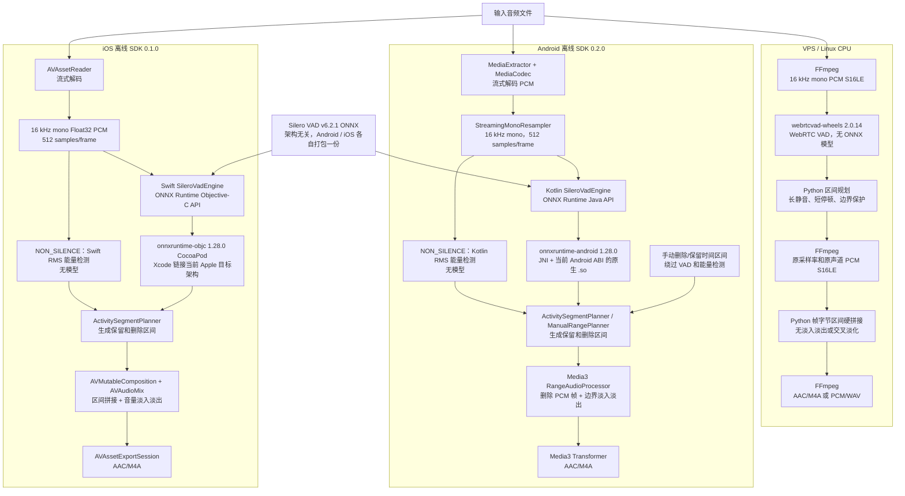

# vad_solution

跨平台“长静音裁剪”方案，拆成三个相互独立的目录：

```text
vps/       CPU 后端：WebRTC VAD + FFmpeg/Python PCM S16LE 区间硬拼接 + AAC/M4A 或 PCM/WAV
android/   Android 离线 SDK：Silero ONNX + ONNX Runtime Android JNI/多 ABI + MediaCodec/Media3 AAC/M4A
ios/       iOS 离线 SDK：同一 Silero ONNX + ONNX Runtime Objective-C/Apple 目标架构 + AVFoundation AAC/M4A
```

## 三平台真实 VAD 架构

三套实现相互独立。VPS 使用无神经网络模型的 WebRTC VAD；Android 和 iOS 使用
内容完全相同的 Silero VAD v6.2.1 ONNX 文件，但各自在自己的 SDK 资源中打包一份。
该 ONNX 文件与 CPU 架构无关，大小均为 `2,327,524` bytes，SHA-256 均为
`1a153a22f4509e292a94e67d6f9b85e8deb25b4988682b7e174c65279d8788e3`。



### 模型、ABI 与原生运行时的关系

| 平台 | VAD 模型 | 原生运行时与架构选择 | 运行时是否下载 |
| --- | --- | --- | --- |
| VPS | 无模型；`webrtcvad-wheels==2.0.14` 的 WebRTC VAD | 部署时安装与服务器 OS/CPU 匹配的 Python wheel 和 FFmpeg | 否 |
| Android | AAR `assets` 中的一份 Silero ONNX | Gradle 构建时解析 `onnxruntime-android:1.28.0`；当前 Example APK 包含 `arm64-v8a`、`armeabi-v7a`、`x86_64` 的 `libonnxruntime.so` 和 `libonnxruntime4j_jni.so`，Android 只加载当前 ABI | 否 |
| iOS | CocoaPods resource bundle 中的一份相同 Silero ONNX | CocoaPods 构建时解析 `onnxruntime-objc:1.28.0`；Xcode 为当前 iPhone/iPad 或 Simulator 目标链接对应的 Apple 原生架构，不使用 Android ABI 名称 | 否 |

所以从广义上说，Android 和 iOS 都需要“与硬件架构匹配的 ONNX Runtime 原生二进制”；
但严格来说只有 Android 使用 `arm64-v8a` 等 Android ABI。iOS 使用 Xcode 的 Apple
设备/模拟器目标架构选择。两端变化的是 ONNX Runtime 原生库，不是 Silero ONNX
模型；依赖只在构建阶段解析，音频处理运行阶段完全离线。

## Android 推荐主链路

Android 默认使用 `android/` 中的纯本地 SDK，不上传录音：

```text
Android Uri（设备支持的音频格式）
    → MediaExtractor / MediaCodec 流式解码
    → Silero VAD 检测语音区间
    → 删除长静音，保留短停顿和语音边界
    → Media3 导出 AAC/M4A
```

SDK 支持 Kotlin 和 Java，包含进度、取消、保留/删除区间报告、Kotlin/Java 示例和 Maven 发布配置。模型与处理均在设备端运行，不依赖网络或 VPS。

## VPS 可选链路

需要让 Android、iOS 或其他客户端统一由服务器处理时，可以使用 `vps/`：

```text
Android / iOS
    → 录音文件（M4A/AAC）
    → multipart 上传到 VPS
    → FFmpeg 解码为 16 kHz 单声道 PCM S16LE
    → WebRTC VAD（webrtcvad-wheels）逐帧检测语音
    → 根据长静音、边界停顿和语音保护参数生成保留区间
    → FFmpeg 按输入原采样率和原声道数解码 PCM S16LE
    → Python 按帧字节偏移拷贝并顺序拼接保留区间
    → FFmpeg 编码 AAC/M4A，或封装 PCM S16LE/WAV 后返回
```

VPS 当前使用 WebRTC VAD，不使用 Silero、GPU 或神经网络模型。“PCM 重建”指按检测出的时间区间裁取并拼接原采样率、原声道数的 16-bit PCM，不是生成式音频修复。VPS 方案适合希望统一检测算法和阈值、降低客户端包体或跨平台复用同一处理结果的场景；它不是 Android SDK 的必需依赖。

## 目录

- [VPS 服务](vps/README.md)
- [Android 离线 VAD SDK](android/README.md)
- [iOS 离线 VAD SDK](ios/README.md)

## API 契约

```http
POST /v1/audio/remove-long-silence
Content-Type: multipart/form-data
X-API-Key: <private-api-key>
```

字段：

```text
file              音频文件
output_format     m4a 或 wav
frame_ms          10、20 或 30
aggressiveness    0 到 3
min_silence_ms    长静音阈值
keep_silence_ms   长静音两端保留的停顿
padding_ms        语音前后保护区间
min_speech_ms     最短语音区间
```

成功响应是音频二进制，不是 Base64 JSON：

```http
200 OK
Content-Type: audio/mp4
```

## 当前状态

- VPS 版本已经实现并在本地真实音频和 HTTP 接口上验证。
- Android 已实现完整本地离线 SDK，支持 Silero VAD、能量非静音模式、Android `Uri` 输入和 AAC/M4A 导出；正式投产前仍需完成真机矩阵与长录音压力测试。
- iOS 已实现与 Android 对齐的本地离线 SDK，使用同一 Silero 模型，并由 macOS GitHub Actions 执行 Xcode 模拟器构建、推理和 M4A 端到端测试；正式投产前仍需真实 iPhone 验证。
