# VadCut — 跨平台长静音裁剪

**简体中文** · [English](README_EN.md)

<!-- markdownlint-disable MD013 -->

[](https://github.com/tianrking/vad_solution/actions/workflows/ios-sdk.yml)
[](https://github.com/tianrking/vad_solution/actions/workflows/linux-service.yml)


VadCut 把“输入录音 → 找出语音/非静音区间 → 删除长静音 → 重新合成完整音频”实现为
三套相互独立的方案：Linux HTTP 服务、Android 离线 SDK 和 iOS 离线 SDK。它们共享
同一业务目标，但根据部署环境使用不同的 VAD、解码器和输出链路。

> VadCut 是 VAD/音频剪辑项目，不是语音转文字（ASR）。它不会生成转写，也不理解
> 句子语义；移动端和服务端都是根据声音活动生成时间区间。

## 项目能做什么

- 自动删除较长的安静区间，同时保留短停顿、词头、词尾和切点保护区。
- Android/iOS 默认使用 Silero VAD，只保留人声；也可显式使用无模型的 RMS 能量检测。
- 三个平台都支持调用方直接传入原录音时间轴上的保留/删除区间，并绕过自动检测。
- 返回原始时长、输出时长、删除时长以及保留/删除区间；Linux 还可返回音频与完整 JSON 清单 ZIP。
- 采用流式解码/分析，不把几小时的 PCM 一次性载入内存。
- 移动端完全离线；Linux 服务适合多个客户端共用统一策略。

## 三种使用场景

| 场景 | 当前版本与技术栈 | 实际 VAD | 音频重建与输出 | 适合什么业务 |
| --- | --- | --- | --- | --- |
| **Linux CPU 服务** | `0.2.0` · `Python 3.11+` · `FastAPI` · `FFmpeg` · `Docker` | `webrtcvad-wheels 2.0.14`，无 ONNX 模型；可手动区间 | 原采样率/原声道 PCM S16LE 帧级拼接与 8 ms 淡化；AAC/M4A、PCM/WAV 或音频 + JSON ZIP | Web、桌面、多端统一处理；统一阈值；不想把模型放进客户端 |
| **Android 离线 SDK** | `0.2.0` · `Kotlin/Java` · `MediaCodec` · `Media3` · `ONNX Runtime 1.28.0` | 默认 Silero VAD v6.2.1；可选 RMS 能量；可手动区间 | PCM 帧裁剪与 8 ms 边界淡化；AAC/M4A | 语音备忘录、会议、采访等隐私优先、无需上传的 Android App |
| **iOS 离线 SDK** | `0.2.0` · `Swift/Objective-C` · `AVFoundation` · `ONNX Runtime 1.28.0` | 默认同一 Silero VAD v6.2.1；可选 RMS 能量；可手动区间 | `AVMutableComposition` 区间拼接与淡化；AAC/M4A | 需要本地处理、Swift/Objective-C 接入的 iPhone/iPad App |

选择建议很简单：移动端要求录音不出设备时，分别使用 Android/iOS SDK；Web、桌面、
旧客户端或需要统一服务端策略时，使用 Linux 服务。Android 和 iOS SDK 都不依赖它。

## 三平台真实架构

```mermaid
flowchart TB
    INPUT(["输入音频文件"])

    subgraph LINUX["Linux CPU HTTP 服务"]
        V0{"传入手动区间？"}
        VM["校验、排序、合并、求补集<br/>绕过 WebRTC VAD"]
        V1["FFmpeg 分析解码<br/>16 kHz mono PCM S16LE"]
        V2["WebRTC VAD<br/>10 / 20 / 30 ms 二值判断"]
        V3["Python 区间规划<br/>长静音、真实语音时长、边界保护"]
        V4["FFmpeg 重建解码<br/>原采样率、原声道 PCM S16LE"]
        V5["Python 按 PCM 帧复制并顺序拼接<br/>真实切点 8 ms 淡化"]
        V6["FFmpeg<br/>AAC/M4A 或 PCM/WAV"]
        V7["音频 + 完整区间响应头<br/>或 ZIP + metadata.json"]
        V0 -- "否" --> V1 --> V2 --> V3 --> V4
        V0 -- "是" --> VM --> V4
        V4 --> V5 --> V6 --> V7
    end

    subgraph ANDROID["Android 离线 SDK"]
        A0["TrimRequest<br/>默认 VOICE_MEMO + SPEECH"]
        A1{"传入手动区间？"}
        AM["MediaCodec 时长探测 + ManualRangePlanner<br/>绕过全部自动检测"]
        A2["MediaExtractor + MediaCodec<br/>流式解码 PCM"]
        A3["16 kHz mono Float32<br/>512 samples / 32 ms"]
        A4{"检测模式"}
        AS["SPEECH：默认<br/>Silero ONNX + ORT Java/JNI"]
        AE["NON_SILENCE：显式选择<br/>Kotlin RMS 能量，无模型"]
        AP["ActivitySegmentPlanner<br/>保留/删除区间"]
        AX["Media3 RangeAudioProcessor + Transformer<br/>裁剪、淡化、AAC/M4A"]
        A0 --> A1
        A1 -- "是" --> AM --> AX
        A1 -- "否" --> A2 --> A3 --> A4
        A4 -- "SPEECH" --> AS --> AP
        A4 -- "NON_SILENCE" --> AE --> AP
        AP --> AX
    end

    subgraph IOS["iOS 离线 SDK"]
        I0["TrimRequest<br/>默认 voiceMemo + speech"]
        I1{"传入 manualTrimPlan？"}
        IM["AVAssetReader 时长解码 + ManualRangePlanner<br/>绕过 Silero 和 RMS"]
        ID["AVAssetReader 流式解码<br/>16 kHz mono Float32 / 32 ms"]
        I2{"检测模式"}
        IS["speech：默认<br/>同一 Silero ONNX + ORT Objective-C"]
        IE["nonSilence：显式选择<br/>Swift RMS 能量，无模型"]
        IP["ActivitySegmentPlanner<br/>保留/删除区间"]
        IX["AVMutableComposition + AVAudioMix<br/>拼接、淡化、AAC/M4A"]
        I0 --> I1
        I1 -- "是" --> IM --> IX
        I1 -- "否" --> ID --> I2
        I2 -- "speech" --> IS --> IP
        I2 -- "nonSilence" --> IE --> IP
        IP --> IX
    end

    INPUT --> V0
    INPUT --> A0
    INPUT --> I0
```



### Silero、ONNX Runtime 与 ABI 的关系

本项目没有把 Silero “交叉编译成多份模型”。Android 和 iOS 使用同一个与 CPU 架构
无关的 ONNX 模型；真正按架构区分的是 ONNX Runtime 原生运行库。

| 项目 | 当前真实实现 |
| --- | --- |
| Silero 模型 | v6.2.1，`silero_vad.onnx`，`2,327,524` B（约 2.22 MiB） |
| 模型一致性 | Android/iOS 两份资源 SHA-256 均为 `1a153a22f4509e292a94e67d6f9b85e8deb25b4988682b7e174c65279d8788e3` |
| Android 运行时 | `onnxruntime-android:1.28.0`：Java API → JNI → 设备 ABI 的原生 `.so` |
| Android ABI | `arm64-v8a`、`armeabi-v7a`、`x86_64`；不包含 32 位 `x86`、旧 `armeabi` 或 MIPS |
| iOS 运行时 | `onnxruntime-objc:1.28.0` CocoaPod；XCFramework 为真机 `arm64`、模拟器 `arm64` + `x86_64` |
| 运行时联网 | 不需要；依赖和模型在构建时进入 App，处理录音时不会下载模型或上传音频 |
| Linux | 不使用 Silero、ONNX 或 ONNX Runtime；自动模式固定使用 CPU WebRTC VAD，手动区间模式绕过 VAD |

因此，在移动端进入 ORT 推理路径就表示正在执行 Silero；ORT 不是另一种 VAD。显式选择
`NON_SILENCE` 时只执行 RMS 能量检测，不加载模型，但 ORT 二进制仍可能作为构建依赖存在于 App 中。

### 什么时候运行哪一种检测

| 调用方式 | 实际检测器 | 是否执行 Silero / ORT |
| --- | --- | --- |
| Android 默认请求或三个预设 | Silero VAD；三个预设都保持 `SPEECH`，只改变阈值和时间参数 | 是 / 是 |
| Android 显式 `NON_SILENCE` | Kotlin RMS 能量检测，默认阈值 `-45 dB` | 否 / 否 |
| Android 手动保留/删除区间 | 时长探测 + `ManualRangePlanner` | 否 / 否 |
| iOS 默认请求或三个预设 | Silero VAD；三个预设都保持 `.speech` | 是 / 是 |
| iOS 显式 `.nonSilence` | Swift RMS 能量检测，默认阈值 `-45 dB` | 否 / 否 |
| iOS 手动保留/删除区间 | 时长解码 + `ManualRangePlanner` | 否 / 否 |
| Linux HTTP 自动模式 | CPU WebRTC VAD 二值判断 | 否 / 否 |
| Linux HTTP 手动保留/删除区间 | 原时间轴区间规划，绕过 WebRTC VAD | 否 / 否 |

这里的“否 / 否”只表示本次分析不会加载 Silero 或创建 ORT 推理会话，不代表构建产物
一定剔除了 ORT。能量模式对每个 32 ms Float32 PCM 帧执行：

```text
RMS = sqrt(sum(sample²) / N)
dB  = 20 × log10(max(RMS, 极小正数))
dB >= energyThresholdDb（默认 -45 dB）→ 活动帧，否则静音帧
```

它只能判断“响不响”，不能判断是不是人声；音乐、键盘、碰撞声和风噪都可能被保留。

## 中文、英文与其他语言

- 项目首页默认使用中文，并提供内容对齐的 [English README](README_EN.md)。
- VAD 检测的是声学上的“有人声/有声音”，接口没有中文或英文语言参数，也不会输出文字。
- 中文、英文及其他语言的录音都可作为输入；当前仓库已提交三平台共用的真人普通话回归样本，Android 有真机结果，iOS 和 Linux 有自动化回归。
- 当前尚未提交同等级的英文、多口音和多噪声真机回归集，正式产品仍应使用目标用户语料验收误删率和漏删率。

## 默认自动裁剪规则

Android 与 iOS 的默认 `VOICE_MEMO + SPEECH` 参数一致：

| 参数 | 默认值 | 含义 |
| --- | ---: | --- |
| 分析帧 | 32 ms / 512 samples | 16 kHz 单声道 Float32 输入 Silero |
| 开始说话概率 | `>= 0.55` | 从非语音进入语音状态 |
| 继续说话概率 | `>= 0.35` | 阈值迟滞，避免边界抖动 |
| 确认长静音 | `700 ms` | 低于 0.35 连续达到该时长才确认结束 |
| 语音前保护 | `180 ms` | 下一段语音开始前保留 |
| 语音后保护 | `250 ms` | 上一段语音结束后保留 |
| 最短语音 | `96 ms` | 过滤极短活动段 |
| 切点淡入淡出 | `8 ms` | 降低拼接爆音风险 |
| 未检测到语音 | 保留原音频 | 默认安全策略，可改为失败 |

`700 ms` 是确认门槛，不是固定保留 700 ms。短于门槛的停顿通常留在同一语音段；确认
为长静音后，规划器回溯边界，并留下前后保护：

```text
语音 A ── 保留 250 ms ──【删除中间长静音】── 保留 180 ms ── 语音 B
```

例如检测到 1.5 秒的中间静音，按默认保护量估算可删除约
`1500 - 250 - 180 = 1070 ms`；最终切点仍受 32 ms 帧粒度和模型判断影响。

Linux 的默认规则独立于移动端：20 ms 帧、WebRTC aggressiveness 2、800 ms 长静音
门槛、250 ms 总边界静音、80 ms padding、160 ms 最短真实语音和 8 ms 切点淡化。
实现会把 250 ms 分到两侧，默认每侧有效保护为 `max(80, 250 / 2) = 125 ms`；
未检测到语音时默认保留原内容，也可配置为返回错误。

## 真人普通话裁剪前后对比

这组文件可以直接用于试听和回归。输入由两段 Google FLEURS 真人普通话组成，中间插入
精确 4.000 秒数字静音；输出由 OPPO PEGM10 / Android 13 / `arm64-v8a` 真机运行
Android SDK 默认 Silero 模式后导出，不是电脑按固定时间点预制。

| 对比 | 播放或下载 | 时长 | 说明 |
| --- | --- | ---: | --- |
| 裁剪前 | [▶ `mandarin-silence-demo.mp3`](android/vadcut/src/androidTest/assets/mandarin-silence-demo.mp3?raw=1) | 15.200 秒 | 真人中文 A + 4 秒静音 + 真人中文 B |
| 裁剪后 | [▶ `mandarin-silence-demo-after-android.m4a`](android/demo-audio/mandarin-silence-demo-after-android.m4a?raw=1) | FFprobe 播放 9.948 秒 | 真机 AAC/M4A 输出；Android 轨道报告 10.048 秒 |

本次结果规划删除 `5,124 ms / 33.7%`，中央删除区间 `[7002, 11564)` ms 完整覆盖插入的
`[7110, 11110)` ms 静音。由于输入 MP3 与输出 M4A 的编码和码率不同，不能直接用二者
字节数判断裁剪收益；同设备、同编码的完整 M4A 对照从 185,495 B 降到 123,095 B，减少
`33.6%`。来源、许可证、参数、哈希和区间见 [Android 详细报告](android/README.md#真人普通话-mp3--4-秒静音结果2026-08-20)。

## 输出与时间信息

| 平台 | 音频输出 | 可获取的信息 | 当前差异 |
| --- | --- | --- | --- |
| Linux | M4A/WAV，或音频 + `metadata.json` ZIP | 原始/输出/删除时长、输入/输出大小、检测器、`kept_ranges_ms`、`removed_ranges_ms`、参数和 warnings | 长区间列表建议使用 `response_mode=archive`，避免响应头长度限制 |
| Android | AAC/M4A `Uri` | `inputDurationMs`、`outputDurationMs`、`removedDurationMs`、`keptRanges`、`removedRanges`、warnings | 支持自动检测、手动保留区间和手动删除区间 |
| iOS | AAC/M4A 文件 URL | `inputDurationMilliseconds`、`outputDurationMilliseconds`、`removedDurationMilliseconds`、`keptRanges`、`removedRanges`、warnings | 支持自动检测、手动保留区间和手动删除区间 |

三个平台的区间都使用**原始录音时间轴**，可用于波形标记、审计日志、二次编辑或把用户
选择的切点再次传给手动模式。

## 快速开始

### Linux / Docker

```bash
cd linux
cp .env.example .env
docker compose up -d --build
curl http://127.0.0.1:8080/healthz
```

```bash
curl -X POST http://127.0.0.1:8080/v1/audio/remove-long-silence \
  -H "X-API-Key: <private-api-key>" \
  -F "file=@input.m4a" \
  -F "output_format=m4a" \
  --output output.m4a
```

完整的自动规则、手动区间、元数据、资源限制和反向代理建议见
[Linux 服务文档](linux/README.md)。

### Android / Kotlin

```kotlin
val request = TrimRequest.Builder(inputUri, outputUri)
    .setConfig(TrimConfig.fromPreset(TrimPreset.VOICE_MEMO))
    .build()

val result = VadCut.with(context).trim(request)
println("removed=${result.removedDurationMs} ms")
println("ranges=${result.removedRanges}")
```

SDK 同时提供 Java API、异步回调、进度、取消、Kotlin/Java 示例以及本地 Maven/AAR
交付方式，详见 [Android SDK 文档](android/README.md)。

### iOS / Swift

```ruby
pod 'VadCutIOS', :git => 'https://github.com/tianrking/vad_solution.git', :branch => 'main'
```

```swift
let request = TrimRequest(
    inputURL: inputURL,
    outputURL: outputURL,
    config: .preset(.voiceMemo)
)

let result = try await VadCut.trim(request)
print(result.removedDurationMilliseconds)
print(result.removedRanges)
```

传入 `manualTrimPlan: .removeRanges(...)` 或 `.keepRanges(...)` 可直接按原始时间轴裁剪，
并绕过 Silero/能量检测。Swift 与 Objective-C 完整示例见 iOS 文档。

Objective-C bridge、取消和 Xcode/CocoaPods 构建方式见 [iOS SDK 文档](ios/README.md)。

## 仓库结构

```text
vad_solution/
├─ linux/               FastAPI + WebRTC VAD + FFmpeg/Python PCM 重建服务
├─ android/             Kotlin/Java 离线 SDK、示例、测试和真机音频证据
├─ ios/                 Swift/Objective-C 离线 SDK、Xcode 测试和资源
├─ VadCutIOS.podspec    iOS CocoaPods 规格
└─ .github/workflows/   Linux/Ubuntu 与 iOS/macOS 构建测试
```

## 当前验证状态

| 平台 | 已有证据 | 尚不能据此宣称 |
| --- | --- | --- |
| Linux | Windows/Python 3.11/FFmpeg 8.1 本地 `21/21`：单元、健康检查、HTTP、手动区间、无语音策略、ZIP 清单、文档一致性及真人中文 MP3 全链路通过；已配置 Ubuntu CI 和容器构建 | 本机没有 Docker，新增容器工作流需推送后由 GitHub Actions 验证；也不等于队列、对象存储或生产压测验收 |
| Android | OPPO PEGM10 / Android 13 / `arm64-v8a` 真人中文 MP3、真实 WAV、同编码体积对照、手动保留/删除全链路 `4/4`；单测、Release AAR、Lint、16 KB ELF/APK 对齐通过 | `armeabi-v7a` 和 `x86_64` 目前是打包/构建证据，不是对应硬件真机证据；尚缺多厂商和长录音压力矩阵 |
| iOS | macOS CI 的 Xcode Simulator 自动 Silero、RMS、手动保留/删除、真人中文 MP3、Objective-C 与 pod lint 共 `17/17` 通过 | 不能替代真实 iPhone 的功耗、温度、后台执行和设备编解码兼容性验证 |

## 重要边界

- 三套方案当前都处理**已有音频文件**，不直接负责麦克风录音或实时流式 VAD。
- Android/iOS 输出会重新编码为 AAC/M4A；Linux M4A 也会重新编码，不是无损码流复制。
- 能量模式只判断“响不响”，音乐、键盘和风噪都可能被保留；只保留人声应使用默认 Silero 模式。
- Linux 接口当前为同步处理，默认最大上传 200 MB、最大音频 3,600 秒、最大并发 2。
- 自动裁剪参数没有一组能覆盖所有口音、距离、噪声和麦克风；上线前必须用目标语料统计误删和漏删。

## 详细文档

- [Linux CPU 服务](linux/README.md)
- [Linux CPU service (English)](linux/README_EN.md)
- [Android 离线 SDK](android/README.md)
- [iOS 离线 SDK](ios/README.md)
- [English project overview](README_EN.md)

## 许可证与第三方组件

Android 和 iOS SDK 分别在各自目录声明 Apache-2.0，并保留 Silero、ONNX Runtime、
Media3、FLEURS 测试素材等第三方声明。请查看
[Android LICENSE](android/LICENSE)、[Android third-party notices](android/THIRD_PARTY_NOTICES.md)、
[iOS LICENSE](ios/LICENSE) 和 [iOS third-party notices](ios/THIRD_PARTY_NOTICES.md)。
仓库当前没有覆盖全部目录的根级统一 `LICENSE`，因此不要推断 Linux 目录自动适用移动端许可证。
