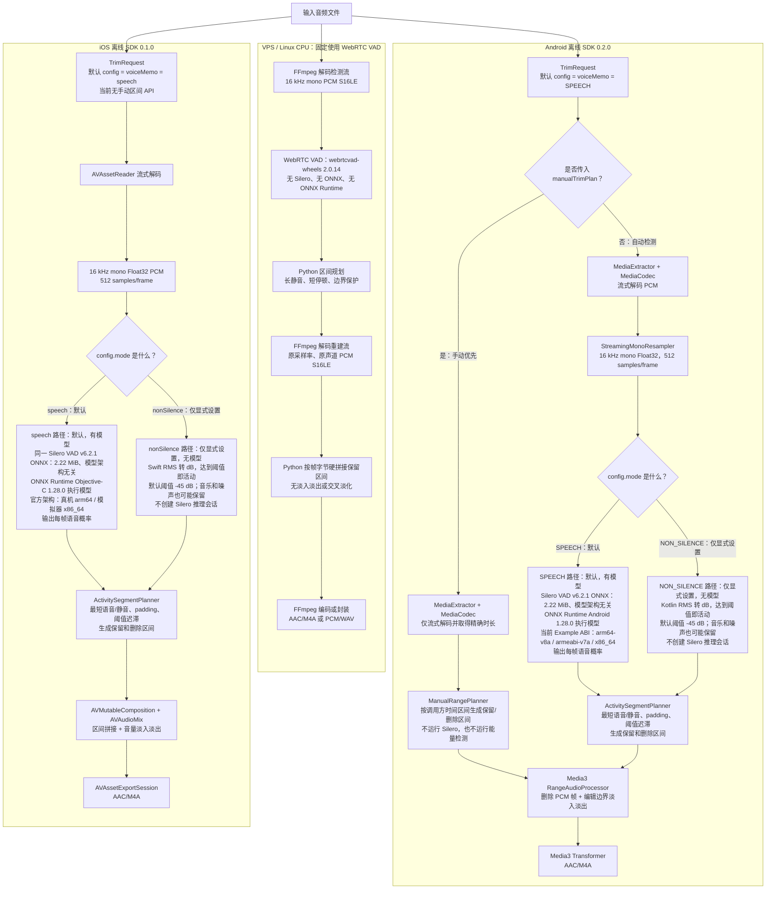

# vad_solution

跨平台“长静音裁剪”方案，拆成三个相互独立的目录：

```text
vps/       CPU 后端：WebRTC VAD + FFmpeg/Python PCM S16LE 区间硬拼接 + AAC/M4A 或 PCM/WAV
android/   Android 离线 SDK：Silero ONNX + ONNX Runtime Android JNI/多 ABI + MediaCodec/Media3 AAC/M4A
ios/       iOS 离线 SDK：同一 Silero ONNX + ONNX Runtime Objective-C/Apple 目标架构 + AVFoundation AAC/M4A
```

## 三平台真实 VAD 架构

先给出不会混淆的结论：

- **Android 默认走 Silero**：`TrimRequest.Builder(...).build()` 默认使用
  `voiceMemo`，而 `voiceMemo` 的 `mode` 是 `SPEECH`。`conservative`、
  `voiceMemo`、`aggressive` 三个预设默认也全部是 `SPEECH`，只调整阈值和时间参数。
- **iOS 默认也走 Silero**：`TrimRequest` 默认配置是 `voiceMemo`，其 `mode` 是
  `.speech`；三个预设同样默认全部是 `.speech`。
- **`NON_SILENCE` 不是 Silero 的自动降级路径**：只有调用方显式设置
  `NON_SILENCE` / `.nonSilence` 才走 RMS 能量检测。它没有模型，不判断是不是人声。
- **Android 手动区间优先级最高**：传入 `manualTrimPlan`、`setRemovedRanges` 或
  `setKeptRanges` 后，会绕过 Silero 和能量检测；iOS 0.1.0 当前没有手动区间 API。
- **VPS 固定使用 WebRTC VAD**：不使用 Silero，也不使用 ONNX Runtime。

`ONNX` 是模型文件格式；本项目移动端唯一的 ONNX 文件就是 Silero VAD 模型。
`ONNX Runtime`（ORT）不是另一种 VAD，它只是加载并执行 `silero_vad.onnx` 的
原生推理引擎。因此在本项目中，进入 ORT 推理路径就表示正在运行 Silero。



### 什么时候走哪一种检测

| 平台/调用方式 | 真实触发条件 | 实际检测器 | 是否运行 Silero / ORT |
| --- | --- | --- | --- |
| Android 默认请求 | `TrimRequest.Builder(...).build()`，默认 `voiceMemo + SPEECH` | Silero VAD v6.2.1 | 是 / 是 |
| Android 三种预设 | `conservative`、`voiceMemo`、`aggressive` 默认都保持 `SPEECH` | Silero VAD v6.2.1 | 是 / 是 |
| Android 非静音模式 | 调用方显式设置 `TrimMode.NON_SILENCE` | Kotlin RMS 能量检测 | 否 / 否；但 ORT 原生库仍可能随依赖打进 APK |
| Android 手动模式 | 传入 `manualTrimPlan`、`setRemovedRanges` 或 `setKeptRanges` | `ManualRangePlanner`，只按调用方时间区间 | 否 / 否；探测参数被忽略，`fadeDurationMs` 仍生效 |
| iOS 默认请求/三种预设 | 默认 `voiceMemo + .speech`；三个预设默认都保持 `.speech` | Silero VAD v6.2.1 | 是 / 是 |
| iOS 非静音模式 | 调用方显式设置 `.nonSilence` | Swift RMS 能量检测 | 否 / 否；但 ORT framework 仍可能随依赖链接进 App |
| VPS 自动接口 | 服务端没有移动端的 `SPEECH/NON_SILENCE` 模式选择 | WebRTC VAD | 否 / 否 |

这里的“否 / 否”表示本次音频分析不会加载 Silero 模型或创建 ORT 推理会话；不表示
构建产物一定剔除了 ORT 二进制。Android/iOS SDK 在构建时仍声明了 ORT 依赖。

### `NON_SILENCE` 到底是什么

Android 与 iOS 实现相同的判断逻辑，针对每个 16 kHz、512 samples（约 32 ms）
Float32 PCM 帧计算：

```text
RMS = sqrt(sum(sample²) / N)
dB  = 20 × log10(max(RMS, 极小正数))
dB >= energyThresholdDb（默认 -45 dB） => 活动帧 1，否则静音帧 0
```

能量检测器只输出二值 `1/0`，随后仍交给 `ActivitySegmentPlanner` 应用最短语音、
最短静音、前后 padding 等时间规则。因为它只看“响不响”，所以人声、音乐、敲键盘、
风噪等只要达到阈值都可能保留；它适合“删除真正安静的部分”，不适合“只保留人声”。

### Silero 模型、ABI 与 ONNX Runtime 的关系

| 项目 | 当前真实情况 |
| --- | --- |
| Silero 模型版本 | v6.2.1，文件名 `silero_vad.onnx` |
| 单份模型大小 | `2,327,524` bytes，约 `2.22 MiB`；Android 和 iOS 各自在资源中打包一份 |
| 模型一致性 | 两份 SHA-256 都是 `1a153a22f4509e292a94e67d6f9b85e8deb25b4988682b7e174c65279d8788e3` |
| 模型架构 | ONNX 文件本身与 CPU/ABI 无关；同一个模型文件可交给不同平台的 ORT 执行 |
| Android 原生运行时 | `onnxruntime-android:1.28.0`，Java API → JNI → 当前 ABI 的 `libonnxruntime.so` / `libonnxruntime4j_jni.so` |
| Android 当前 Example ABI | `arm64-v8a`、`armeabi-v7a`、`x86_64`；APK 同时带三套库，设备只加载匹配自己 ABI 的一套 |
| iOS 原生运行时 | `onnxruntime-objc:1.28.0` CocoaPod，Swift 调 Objective-C API；项目最低 iOS 15.1 |
| iOS 架构 | 不是 Android ABI。ONNX Runtime 官方 iOS 构建文档列出真机 `arm64`、模拟器 `x86_64`；CocoaPods/Xcode 为当前 Apple target 链接对应产物 |
| 运行时联网 | Gradle/CocoaPods 只在构建阶段解析依赖；模型已随 SDK 打包，处理音频时完全离线、不临时下载模型 |

所以，“Silero 支持哪些架构”更准确的说法是：**Silero ONNX 模型不分架构，真正
区分架构的是 ONNX Runtime 原生库**。Android 当前交付覆盖上述三个 ABI；iOS 由
`onnxruntime-objc` 和 Xcode target 选择 Apple 架构。ONNX Runtime 官方说明其
Objective-C API 用于在 iOS 设备上运行 ONNX 模型，官方 artifact 通过 CocoaPods
发布；详见 [Objective-C API](https://onnxruntime.ai/docs/get-started/with-obj-c.html)
和 [iOS 构建与架构说明](https://onnxruntime.ai/docs/build/ios.html)。

## Android 推荐主链路

Android 默认使用 `android/` 中的纯本地 SDK，不上传录音：

```text
Android Uri（设备支持的音频格式）
    → MediaExtractor / MediaCodec 流式解码
    → Silero VAD 检测语音区间
    → 删除长静音，保留短停顿和语音边界
    → Media3 导出 AAC/M4A
```

SDK 支持 Kotlin 和 Java，包含进度、取消、保留/删除区间报告、Kotlin/Java 示例和 Maven 发布配置。模型与处理均在设备端运行，不依赖网络或 VPS。

## VPS 可选链路

需要让 Android、iOS 或其他客户端统一由服务器处理时，可以使用 `vps/`：

```text
Android / iOS
    → 录音文件（M4A/AAC）
    → multipart 上传到 VPS
    → FFmpeg 解码为 16 kHz 单声道 PCM S16LE
    → WebRTC VAD（webrtcvad-wheels）逐帧检测语音
    → 根据长静音、边界停顿和语音保护参数生成保留区间
    → FFmpeg 按输入原采样率和原声道数解码 PCM S16LE
    → Python 按帧字节偏移拷贝并顺序拼接保留区间
    → FFmpeg 编码 AAC/M4A，或封装 PCM S16LE/WAV 后返回
```

VPS 当前使用 WebRTC VAD，不使用 Silero、GPU 或神经网络模型。“PCM 重建”指按检测出的时间区间裁取并拼接原采样率、原声道数的 16-bit PCM，不是生成式音频修复。VPS 方案适合希望统一检测算法和阈值、降低客户端包体或跨平台复用同一处理结果的场景；它不是 Android SDK 的必需依赖。

## 目录

- [VPS 服务](vps/README.md)
- [Android 离线 VAD SDK](android/README.md)
- [iOS 离线 VAD SDK](ios/README.md)

## API 契约

```http
POST /v1/audio/remove-long-silence
Content-Type: multipart/form-data
X-API-Key: <private-api-key>
```

字段：

```text
file              音频文件
output_format     m4a 或 wav
frame_ms          10、20 或 30
aggressiveness    0 到 3
min_silence_ms    长静音阈值
keep_silence_ms   长静音两端保留的停顿
padding_ms        语音前后保护区间
min_speech_ms     最短语音区间
```

成功响应是音频二进制，不是 Base64 JSON：

```http
200 OK
Content-Type: audio/mp4
```

## 当前状态

- VPS 版本已经实现并在本地真实音频和 HTTP 接口上验证。
- Android 已实现完整本地离线 SDK，支持 Silero VAD、能量非静音模式、手动区间、Android `Uri` 输入和紧凑 AAC/M4A 导出；OPPO Android 13 `arm64-v8a` 真机已通过真实声音自动裁剪、同编码体积对照、手动保留/删除 `3/3` 全链路测试，其他 ABI 当前仍是打包/构建证据，正式投产前仍需完成多机型矩阵与长录音压力测试。
- iOS 已实现与 Android 对齐的本地离线 SDK，使用同一 Silero 模型，并由 macOS GitHub Actions 执行 Xcode 模拟器构建、推理和 M4A 端到端测试；正式投产前仍需真实 iPhone 验证。
