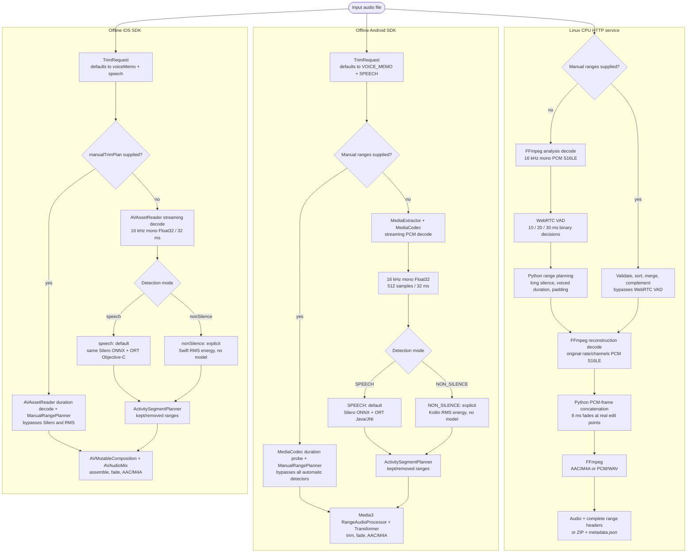

# VadCut — Cross-platform long-silence trimming

[简体中文](README.md) · **English**

<!-- markdownlint-disable MD013 -->

[](https://github.com/tianrking/vad_solution/actions/workflows/ios-sdk.yml)
[](https://github.com/tianrking/vad_solution/actions/workflows/linux-service.yml)


VadCut implements the same workflow—input recording, activity detection, long-silence removal,
and complete audio reconstruction—in three independent forms: a Linux HTTP service, an offline
Android SDK, and an offline iOS SDK. They solve the same product problem but intentionally use
different VAD and media stacks for their deployment environments.

> VadCut is a VAD and audio-editing project, not automatic speech recognition (ASR). It does not
> produce transcripts or understand sentence semantics. It generates time ranges from acoustic
> activity.

## What it does

- Removes long quiet regions while retaining short pauses, word boundaries, and configurable padding.
- Uses Silero VAD by default on Android and iOS to retain speech; an explicit model-free RMS mode is also available.
- Lets callers on all three platforms provide ranges to keep or remove on the original recording timeline.
- Reports input, output, and removed durations plus kept/removed ranges; Linux can also return audio with a complete JSON manifest in a ZIP.
- Streams decode and analysis instead of loading hours of PCM into memory at once.
- Keeps mobile processing fully offline; the Linux service centralizes policy for multiple clients.

## Three deployment scenarios

| Scenario | Version and stack | Actual VAD | Reconstruction and output | Best fit |
| --- | --- | --- | --- | --- |
| **Linux CPU service** | `0.2.0` · `Python 3.11+` · `FastAPI` · `FFmpeg` · `Docker` | `webrtcvad-wheels 2.0.14`; no ONNX model; manual ranges | Frame-accurate source-rate/source-channel PCM S16LE assembly with 8 ms fades; AAC/M4A, PCM/WAV, or audio + JSON ZIP | Web, desktop, shared multi-client processing, centralized thresholds, and smaller clients |
| **Offline Android SDK** | `0.2.0` · `Kotlin/Java` · `MediaCodec` · `Media3` · `ONNX Runtime 1.28.0` | Silero VAD v6.2.1 by default; optional RMS; manual ranges | PCM frame removal with 8 ms boundary fades; AAC/M4A | Private on-device voice memo, interview, and meeting workflows |
| **Offline iOS SDK** | `0.2.0` · `Swift/Objective-C` · `AVFoundation` · `ONNX Runtime 1.28.0` | The same Silero VAD v6.2.1 by default; optional RMS; manual ranges | `AVMutableComposition` range assembly and fades; AAC/M4A | Local iPhone/iPad processing with Swift or Objective-C integration |

Use the Android or iOS SDK when recordings must stay on the device. Use the Linux service for
web/desktop, legacy clients, or a centralized server-side policy. Neither mobile SDK depends on it.

## Actual architecture



### Silero, ONNX Runtime, and ABI

The project does not cross-compile Silero into architecture-specific model files. Android and iOS
use the same architecture-independent ONNX model. ONNX Runtime is the native execution engine,
and its binaries—not the model—vary by target architecture.

| Item | Current implementation |
| --- | --- |
| Silero model | v6.2.1, `silero_vad.onnx`, `2,327,524` bytes (about 2.22 MiB) |
| Model identity | Both mobile resources have SHA-256 `1a153a22f4509e292a94e67d6f9b85e8deb25b4988682b7e174c65279d8788e3` |
| Android runtime | `onnxruntime-android:1.28.0`: Java API → JNI → native libraries for the device ABI |
| Android ABIs | `arm64-v8a`, `armeabi-v7a`, and `x86_64`; no 32-bit `x86`, legacy `armeabi`, or MIPS |
| iOS runtime | `onnxruntime-objc:1.28.0`; its XCFramework has device `arm64` and simulator `arm64` + `x86_64` slices |
| Runtime network use | None; dependencies and model enter the app at build time, and processing neither downloads a model nor uploads audio |
| Linux | No Silero, ONNX, or ONNX Runtime; automatic mode uses CPU WebRTC VAD and manual mode bypasses VAD |

On mobile, entering the ORT inference path therefore means running Silero. ORT is not another VAD.
Explicit `NON_SILENCE` mode runs only RMS energy detection and does not load the model, although ORT
binaries may still be present as build dependencies in the app.

### When each detector runs

| Call path | Actual detector | Runs Silero / ORT |
| --- | --- | --- |
| Android default request or any preset | Silero VAD; all three presets remain in `SPEECH` and only change thresholds/timing | yes / yes |
| Android explicit `NON_SILENCE` | Kotlin RMS energy detector, default threshold `-45 dB` | no / no |
| Android manual keep/remove ranges | Duration probe + `ManualRangePlanner` | no / no |
| iOS default request or any preset | Silero VAD; all three presets remain in `.speech` | yes / yes |
| iOS explicit `.nonSilence` | Swift RMS energy detector, default threshold `-45 dB` | no / no |
| iOS manual keep/remove ranges | Duration decode + `ManualRangePlanner` | no / no |
| Linux HTTP automatic mode | CPU WebRTC VAD Boolean decisions | no / no |
| Linux HTTP manual keep/remove ranges | Original-timeline planner; bypasses WebRTC VAD | no / no |

Here, “no / no” means the analysis does not load Silero or create an ORT inference session; it does
not guarantee that ORT binaries are removed from the built app. Energy mode evaluates each 32 ms
Float32 PCM frame as follows:

```text
RMS = sqrt(sum(sample²) / N)
dB  = 20 × log10(max(RMS, tiny positive value))
dB >= energyThresholdDb (default -45 dB) → active frame; otherwise silent
```

It answers only “is this loud enough?”, not “is this speech?”. Music, keyboard noise, impacts, and
wind may all be retained.

## Chinese, English, and other languages

- The default project page is Chinese, with this content-aligned English version.
- VAD detects acoustic speech/sound activity. There is no Chinese/English language setting and no text output.
- Chinese, English, and other spoken-language recordings can be supplied to the same APIs.
- The repository includes a shared real-Mandarin fixture used by all three platforms. Android has on-device evidence, while iOS and Linux have automated regressions. Equivalent on-device English, accent, and noise-set coverage is still missing, so production accuracy must be accepted on target-user audio.

## Default automatic trimming rules

Android and iOS use the same default `VOICE_MEMO + SPEECH` settings:

| Parameter | Default | Meaning |
| --- | ---: | --- |
| Analysis frame | 32 ms / 512 samples | 16 kHz mono Float32 input to Silero |
| Speech start probability | `>= 0.55` | Enter the speech state |
| Speech continuation probability | `>= 0.35` | Hysteresis to stabilize boundaries |
| Long-silence confirmation | `700 ms` | End speech only after continuous probability below 0.35 |
| Pre-speech padding | `180 ms` | Retained before the next speech segment |
| Post-speech padding | `250 ms` | Retained after the previous speech segment |
| Minimum speech | `96 ms` | Reject very short activity |
| Boundary fade | `8 ms` | Reduce click risk at edit boundaries |
| No speech detected | Keep the original | Safe default; can be changed to failure |

The `700 ms` value confirms a long silence; it is not 700 ms that must remain in the output. Pauses
shorter than the threshold normally stay in the same segment. Once a long silence is confirmed, the
planner backtracks to the boundary and applies padding:

```text
Speech A ── keep 250 ms ── [remove middle long silence] ── keep 180 ms ── Speech B
```

For example, a detected 1.5-second middle silence removes approximately
`1500 - 250 - 180 = 1070 ms`. Exact boundaries still depend on 32 ms frame granularity and model output.

Linux has independent defaults: 20 ms frames, WebRTC aggressiveness 2, an 800 ms long-silence
threshold, 250 ms total boundary silence, 80 ms padding, 160 ms of actual voiced frames, and an
8 ms edit fade. The 250 ms is split across both sides, so effective padding is
`max(80, 250 / 2) = 125 ms` per side. No-speech input is kept by default or can return an error.

## Real Mandarin before/after demo

These files are directly playable regression evidence. The input combines two real Mandarin Google
FLEURS utterances with exactly 4.000 seconds of inserted digital silence. The output was generated on
an OPPO PEGM10 running Android 13 on `arm64-v8a`, using the Android SDK's default Silero mode. It was
not pre-cut on a desktop using fixed timestamps.

| Comparison | Play or download | Duration | Description |
| --- | --- | ---: | --- |
| Before | [▶ `mandarin-silence-demo.mp3`](android/vadcut/src/androidTest/assets/mandarin-silence-demo.mp3?raw=1) | 15.200 s | Real Mandarin A + 4 seconds of silence + real Mandarin B |
| After | [▶ `mandarin-silence-demo-after-android.m4a`](android/demo-audio/mandarin-silence-demo-after-android.m4a?raw=1) | 9.948 s in FFprobe playback | On-device AAC/M4A; Android reports a 10.048 s track duration |

The trim plan removed `5,124 ms / 33.7%`. Its central removed range `[7002, 11564)` ms fully covers
the inserted `[7110, 11110)` ms silence. File sizes of the input MP3 and output M4A are not directly
comparable because their codecs/bitrates differ. Against the full-length M4A produced on the same
device with the same encoding path, size fell from 185,495 to 123,095 bytes (`33.6%`). See the
[detailed Android report](android/README.md#真人普通话-mp3--4-秒静音结果2026-08-20) for provenance,
license, hashes, parameters, and ranges.

## Outputs and timeline metadata

| Platform | Audio output | Available metadata | Current difference |
| --- | --- | --- | --- |
| Linux | M4A/WAV or an audio + `metadata.json` ZIP | Input/output/removed durations, byte sizes, detector, `kept_ranges_ms`, `removed_ranges_ms`, parameters, and warnings | Use `response_mode=archive` for long range lists to avoid header limits |
| Android | AAC/M4A `Uri` | `inputDurationMs`, `outputDurationMs`, `removedDurationMs`, `keptRanges`, `removedRanges`, and warnings | Automatic detection plus caller-supplied keep/remove ranges |
| iOS | AAC/M4A file URL | `inputDurationMilliseconds`, `outputDurationMilliseconds`, `removedDurationMilliseconds`, `keptRanges`, `removedRanges`, and warnings | Automatic detection plus caller-supplied keep/remove ranges |

All three platforms use the **original recording timeline**. Ranges can drive waveform annotations,
audit logs, a second editing pass, or caller-supplied manual edits.

## Quick start

### Linux / Docker

```bash
cd linux
cp .env.example .env
docker compose up -d --build
curl http://127.0.0.1:8080/healthz
```

```bash
curl -X POST http://127.0.0.1:8080/v1/audio/remove-long-silence \
  -H "X-API-Key: <private-api-key>" \
  -F "file=@input.m4a" \
  -F "output_format=m4a" \
  --output output.m4a
```

See the [Linux service documentation](linux/README_EN.md) for automatic rules, manual ranges,
metadata, resource limits, and reverse-proxy guidance.

### Android / Kotlin

```kotlin
val request = TrimRequest.Builder(inputUri, outputUri)
    .setConfig(TrimConfig.fromPreset(TrimPreset.VOICE_MEMO))
    .build()

val result = VadCut.with(context).trim(request)
println("removed=${result.removedDurationMs} ms")
println("ranges=${result.removedRanges}")
```

The SDK also provides Java APIs, callbacks, progress, cancellation, runnable Kotlin/Java samples,
and local Maven/AAR delivery. See the [Android SDK documentation](android/README.md).

### iOS / Swift

```ruby
pod 'VadCutIOS', :git => 'https://github.com/tianrking/vad_solution.git', :branch => 'main'
```

```swift
let request = TrimRequest(
    inputURL: inputURL,
    outputURL: outputURL,
    config: .preset(.voiceMemo)
)

let result = try await VadCut.trim(request)
print(result.removedDurationMilliseconds)
print(result.removedRanges)
```

Supply `manualTrimPlan: .removeRanges(...)` or `.keepRanges(...)` to edit the original timeline
directly and bypass both Silero and energy detection. The iOS guide includes complete Swift and
Objective-C examples.

See the [iOS SDK documentation](ios/README.md) for the Objective-C bridge, cancellation, and
Xcode/CocoaPods setup.

## Repository layout

```text
vad_solution/
├─ linux/               FastAPI + WebRTC VAD + FFmpeg/Python PCM service
├─ android/             Offline Kotlin/Java SDK, samples, tests, and device audio evidence
├─ ios/                 Offline Swift/Objective-C SDK, Xcode tests, and resources
├─ VadCutIOS.podspec    iOS CocoaPods specification
└─ .github/workflows/   Linux/Ubuntu and iOS/macOS build/test workflows
```

## Current validation status

| Platform | Existing evidence | What it does not prove |
| --- | --- | --- |
| Linux | Local Windows/Python 3.11/FFmpeg 8.1 tests pass `21/21` across units, health, HTTP, manual ranges, no-speech policies, ZIP metadata, documentation consistency, and a real Mandarin MP3; Ubuntu CI and a container build are configured | Docker is unavailable on this workstation, so the new container workflow still needs its first pushed Actions run; this is not queue, object-storage, load, or production acceptance |
| Android | OPPO PEGM10 / Android 13 / `arm64-v8a`: real Mandarin MP3, real WAV, same-codec size baseline, manual keep/remove E2E `4/4`; unit tests, release AAR, lint, and 16 KB ELF/APK alignment pass | `armeabi-v7a` and `x86_64` currently have packaging/build evidence, not corresponding hardware-device evidence; multi-vendor and long-recording stress matrices remain |
| iOS | macOS CI passes `17/17` Xcode Simulator tests for automatic Silero, RMS, manual keep/remove, real Mandarin MP3, Objective-C, and pod lint | It cannot replace real-iPhone power, thermal, background execution, and device codec compatibility testing |

## Important boundaries

- All three implementations currently process **existing audio files**; they do not provide microphone recording or real-time streaming VAD.
- Android/iOS re-encode to AAC/M4A, and Linux M4A is also re-encoded; this is not lossless packet copying.
- RMS mode only detects energy. Music, keyboard noise, and wind may be retained; use default Silero mode when the goal is speech only.
- The Linux API is synchronous, with defaults of 200 MB maximum upload, 3,600 seconds maximum duration, and 2 concurrent jobs.
- No automatic configuration fits every accent, distance, noise profile, and microphone. Measure false removals and missed removals on target production audio.

## Detailed documentation

- [Linux CPU service](linux/README_EN.md)
- [Linux CPU 服务](linux/README.md)
- [Offline Android SDK](android/README.md)
- [Offline iOS SDK](ios/README.md)
- [中文项目说明](README.md)

## Licenses and third-party components

The Android and iOS SDK directories each declare Apache-2.0 and preserve notices for Silero,
ONNX Runtime, Media3, and the FLEURS test material. See the
[Android license](android/LICENSE), [Android third-party notices](android/THIRD_PARTY_NOTICES.md),
[iOS license](ios/LICENSE), and [iOS third-party notices](ios/THIRD_PARTY_NOTICES.md).
There is currently no single root-level `LICENSE` covering every directory, so do not infer that the
mobile SDK licenses automatically apply to the Linux directory.
