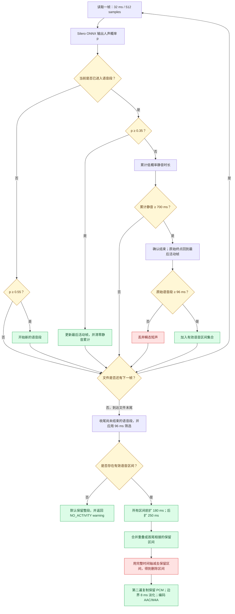
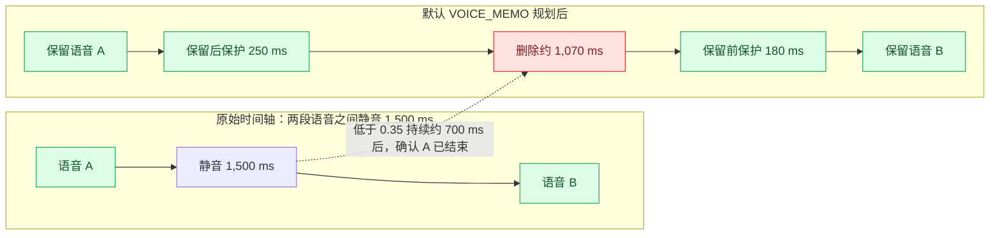

# VadCut Android SDK

完全在 Android 本地运行的长录音语音/静音裁剪 SDK。输入任意 Android `Uri`，SDK 流式解码、检测、拼接并输出 AAC/M4A；不上传音频，不需要 FFmpeg，也不需要存储权限。

当前版本：`0.2.0`

## 能力与边界

- `SPEECH`：使用随包提供的 Silero VAD v6.2.1，只保留人声，适合会议、采访、语音备忘录。
- `NON_SILENCE`：使用 RMS 能量检测，保留人声、音乐和其他非静音声音。
- 手动区间：调用方可传入原录音时间轴上的“删除区间”或“保留区间”，SDK 校验、排序、合并后导出。
- 长音频采用两遍流式处理。PCM 缓冲区大小固定，不把整段录音载入内存；区间元数据随剪切点数量增长。
- 输出固定为 AAC 音轨的紧凑 M4A 文件；有视频轨的输入会只导出音频。输出针对“处理完成后的本地文件”优化，未保留约 400 KB 的 progressive fast-start 预留区；如果业务要求边下载边播放，应在上传侧重新做 fast-start 封装。
- Android 7.0+（API 24），提供 `arm64-v8a`、`armeabi-v7a` 和 `x86_64`。这覆盖主流 64 位 ARM 手机、仍需兼容的 32 位 ARM 旧机和 64 位模拟器，但不是“所有历史 Android”：不提供 32 位 `x86`、已淘汰的 `armeabi`/MIPS。
- 当前真机证据是 OPPO PEGM10 / Android 13 / `arm64-v8a`；`armeabi-v7a`、`x86_64` 当前是 APK 打包、ELF 对齐和编译证据，尚不是对应硬件的真机证据。Android 官方 ABI 定义见 [Android NDK ABI 文档](https://developer.android.com/ndk/guides/abis)。
- 支持 16 KB 内存页：当前依赖中的所有 ARM/x86_64 ELF LOAD 段均为 `0x4000` 对齐，示例 APK 也通过 `zipalign -P 16`。
- 输入格式取决于设备的 `MediaExtractor`/`MediaCodec`。M4A/AAC、MP3、WAV、FLAC、Ogg 等常见格式通常可用，但厂商设备的编解码器集合可能不同。

## 推荐集成：本地 Maven 仓库

将交付包 `vadcut-maven-0.2.0.zip` 解压到项目目录，例如 `third_party/vadcut-maven`，然后在 `settings.gradle.kts` 中添加：

```kotlin
dependencyResolutionManagement {
    repositories {
        google()
        mavenCentral()
        maven { url = uri("$rootDir/third_party/vadcut-maven") }
    }
}
```

应用模块添加一行依赖：

```kotlin
dependencies {
    implementation("com.vadcut:vadcut-android:0.2.0")
}
```

Maven 方式会自动带入 Media3、ONNX Runtime 和 Kotlin Coroutines 的传递依赖。SDK 自身不声明任何 Android 权限。

宿主项目需在 `gradle.properties` 启用 AndroidX：

```properties
android.useAndroidX=true
```

如果只能使用裸 AAR，把 `vadcut-release.aar` 放进 `app/libs` 后，还必须显式加入这些运行时依赖：

```kotlin
implementation(files("libs/vadcut-release.aar"))
implementation("androidx.media3:media3-common:1.11.0")
implementation("androidx.media3:media3-effect:1.11.0")
implementation("androidx.media3:media3-transformer:1.11.0")
implementation("com.microsoft.onnxruntime:onnxruntime-android:1.28.0")
implementation("org.jetbrains.kotlinx:kotlinx-coroutines-android:1.10.2")
```

## Kotlin

```kotlin
val request = TrimRequest.Builder(inputUri, outputUri)
    .setConfig(TrimConfig.fromPreset(TrimPreset.VOICE_MEMO))
    .build()

val task = VadCut.with(context).trimAsync(request, object : TrimListener {
    override fun onProgress(progress: TrimProgress) {
        progressBar.progress = progress.percent
    }

    override fun onSuccess(result: TrimResult) {
        // result.keptRanges / removedRanges 可用于日志、预览或审计。
        println("removed ${result.removedDurationMs} ms")
    }

    override fun onError(error: TrimException) {
        // 若 outputUri 是专为本任务新建的文档，应在这里删除它。
        println("${error.code}: ${error.message}")
    }

    override fun onCancelled() {
        // 删除本任务新建的 outputUri，避免留下 0 字节或部分文件。
    }
})

// 需要时取消：
task.cancel()
```

Kotlin 协程调用也可直接使用：

```kotlin
val result = VadCut.with(context).trim(request) { progress ->
    // 回调固定在主线程。
}
```

## Java

```java
TrimConfig config = TrimConfig.fromPreset(TrimPreset.VOICE_MEMO);
TrimRequest request = new TrimRequest.Builder(inputUri, outputUri)
        .setConfig(config)
        .build();

TrimTask task = VadCut.with(context).trimAsync(request, new TrimListener() {
    @Override public void onProgress(TrimProgress progress) { }
    @Override public void onSuccess(TrimResult result) { }
    @Override public void onError(TrimException error) { /* cleanup newly-created outputUri */ }
    @Override public void onCancelled() { /* cleanup newly-created outputUri */ }
});
```

完整的可运行示例位于 `sample-kotlin` 和 `sample-java`。

## 自动裁剪算法与时间规则

默认 `TrimRequest.Builder(...).build()` 使用 `VOICE_MEMO + SPEECH`，因此真实执行
Silero VAD，而不是能量检测。规则按以下顺序执行：

### 默认 `VOICE_MEMO` 参数速查

| 参数 | 默认值 | 实际作用 |
| --- | ---: | --- |
| 检测模式 | `SPEECH` / Silero VAD v6.2.1 | 识别人声，不是普通音量门限 |
| 检测帧 | 32 ms / 512 samples | 16 kHz 单声道检测流的处理粒度 |
| 开始说话概率 | `≥ 0.55` | 尚未进入语音时，达到此值才开始语音段 |
| 继续说话概率 | `≥ 0.35` | 已进入语音后，达到此值就更新最后活动帧 |
| 确认长静音 | 700 ms | 连续低于 0.35 达到该时长，才确认语音段结束 |
| 语音前保护 | 180 ms | 在每段检测语音之前额外保留原音频 |
| 语音后保护 | 250 ms | 在每段检测语音之后额外保留原音频 |
| 最短语音 | 96 ms | 更短的原始活动段视为瞬态噪声并丢弃 |
| 切点淡入淡出 | 8 ms | 对最终编辑边界线性淡化，降低爆音风险 |
| 未检测到人声 | `KEEP_ORIGINAL` | 保留整段并返回 warning，不生成空音频 |

### 默认自动裁剪判定图



### 1.5 秒中间静音示例



这里的 700 ms 是“确认语音已经结束”的门槛，不是额外强制保留的静音。以上示例在
整段静音都低于结束阈值、下一段语音重新达到开始阈值的前提下，理论删除量约为
`1,500 - 250 - 180 = 1,070 ms`；实际边界会受 32 ms 检测帧以及编码帧粒度影响。
如果两段语音之间的低概率静音不足 700 ms，默认会把它们视为同一个语音段，不执行
中间切割。padding 后的区间若重叠或首尾相接，也会合并并保留中间内容。

1. `MediaExtractor`/`MediaCodec` 流式解码输入。检测支路混为单声道并重采样到
   16 kHz Float32 PCM，每 `512 samples = 32 ms` 形成一帧；不会把整段录音载入内存。
2. `SPEECH` 模式把每帧和连续的 recurrent state 送入 Silero VAD v6.2.1 ONNX，
   ONNX Runtime 返回 `0..1` 的人声概率。每次新任务创建新检测器，录音之间不共享状态。
3. 尚未进入语音时，概率达到 `speechStartThreshold` 才开始区间；进入语音后，
   只要概率仍达到较低的 `speechEndThreshold`，就更新“最后活动帧”。默认双阈值是
   `0.55 / 0.35`，用于减少边缘抖动。
4. 概率跌到结束阈值以下不会立刻切断。连续低概率达到
   `minimumSilenceDurationMs` 后才确认区间结束，但原始语音区间终点回到“最后活动帧”，
   不会把整段确认静音都保留下来。
5. 原始区间短于 `minimumSpeechDurationMs`（默认 96 ms）会被丢弃，防止瞬态噪声形成切片。
6. 对每段有效区间增加 `paddingBeforeMs` / `paddingAfterMs`，裁到音频边界内；扩展后
   重叠或首尾相接的区间会合并。因此短停顿通常保留，只有足够长的静音才形成删除区间。
7. 完整时间轴减去保留区间得到 `removedRanges`。第二遍按原输入的采样率和声道解码，
   `RangeAudioProcessor` 只复制保留的 PCM 帧，在每个编辑边界应用默认 8 ms 线性淡入淡出，
   最后只编码一次 AAC/M4A。
8. 完全没有检测到活动时，默认 `KEEP_ORIGINAL`：导出整段并返回
   `NO_ACTIVITY_DETECTED_KEPT_ORIGINAL` warning；也可设成 `FAIL`。

`NON_SILENCE` 仍使用同一个区间规划器，但不会加载 Silero。它对每个 32 ms 帧计算
`RMS → 20 × log10(RMS)`，达到 `energyThresholdDb`（默认 -45 dB）就输出活动值 `1`，
否则输出 `0`；所以音乐、键盘声和风噪也可能被保留。

## 自定义切割时间点

时间点始终基于**原始输入音频**，单位为毫秒；区间是半开区间 `[startTimeMs, endTimeMs)`。两种模式互斥：

- `setRemovedRanges(...)`：删除给定区间，保留其余内容。
- `setKeptRanges(...)`：只保留给定区间，删除其余内容。

Kotlin 删除指定区间：

```kotlin
val request = TrimRequest.Builder(inputUri, outputUri)
    .setRemovedRanges(
        AudioRange(5_200, 8_600),
        AudioRange(15_300, 21_100),
    )
    .setConfig(TrimConfig.Builder().setFadeDurationMs(8).build())
    .build()
```

Kotlin 只保留指定区间：

```kotlin
val request = TrimRequest.Builder(inputUri, outputUri)
    .setKeptRanges(
        listOf(
            AudioRange(1_000, 4_000),
            AudioRange(8_000, 12_500),
        )
    )
    .build()
```

Java：

```java
List<AudioRange> removed = Arrays.asList(
        new AudioRange(5_200L, 8_600L),
        new AudioRange(15_300L, 21_100L)
);
TrimRequest request = new TrimRequest.Builder(inputUri, outputUri)
        .setManualTrimPlan(ManualTrimPlan.removeRanges(removed))
        .build();
```

手动区间规则：

1. 区间可乱序、重叠或首尾相接；SDK 会排序并合并。
2. 区间必须为正长度，且不能超过解码得到的原音频时长。
3. 不允许删除整段音频；这种请求返回 `INVALID_TIME_RANGES`，不会生成一个伪装成功的空音频。
4. 手动模式不会加载或运行 Silero/能量检测器；`TrimConfig` 中仅 `fadeDurationMs` 影响切点，其余检测参数被忽略。
5. `TrimResult.keptRanges` 和 `removedRanges` 返回最终规范化后、真正用于导出的原时间轴区间。
6. 在同一个 Builder 上多次设置手动模式时，最后一次设置生效；调用 `useAutomaticDetection()` 可恢复自动 VAD/能量检测。

编译过的调用示例分别位于：

```text
sample-kotlin/.../ManualTrimExamples.kt
sample-java/.../ManualTrimExamples.java
```

## 参数选择

推荐先使用预设：

| 预设 | 模式 | 开始/结束阈值 | 最短语音 | 确认静音 | 前/后 padding | 切点淡化 |
| --- | --- | --- | ---: | ---: | ---: | ---: |
| `CONSERVATIVE` | `SPEECH` / Silero | `0.55 / 0.35` | 96 ms | 1,200 ms | 250 / 350 ms | 8 ms |
| `VOICE_MEMO`（默认） | `SPEECH` / Silero | `0.55 / 0.35` | 96 ms | 700 ms | 180 / 250 ms | 8 ms |
| `AGGRESSIVE` | `SPEECH` / Silero | `0.60 / 0.40` | 96 ms | 350 ms | 100 / 140 ms | 8 ms |

三个预设默认全部运行 Silero；预设只改变阈值和时间规则。只有显式设置
`TrimMode.NON_SILENCE` 才改用能量检测。

自定义示例：

```kotlin
val config = TrimConfig.Builder()
    .setMode(TrimMode.SPEECH)
    .setMinimumSilenceDurationMs(800)
    .setPaddingBeforeMs(200)
    .setPaddingAfterMs(300)
    .setFadeDurationMs(8)
    .setNoSpeechPolicy(NoSpeechPolicy.KEEP_ORIGINAL)
    .build()
```

默认使用双阈值滞回（开始 `0.55`、结束 `0.35`）以减少边界抖动；每个保留区间的两端应用短淡入淡出，避免切点爆音。未检测到活动时默认保留整段并在 `warnings` 中返回 `NO_ACTIVITY_DETECTED_KEPT_ORIGINAL`，不会意外生成空文件。

## 长任务与生命周期

SDK 不擅自创建 Service 或通知。前台页面内可直接使用 `TrimTask`；需要在锁屏、切后台或进程重启后继续的长任务，应由宿主应用放入 WorkManager 或 Foreground Service，并持久化 SAF URI 权限。不要把输入和输出设为同一个 URI。

`ACTION_CREATE_DOCUMENT` 会在处理开始前先创建目标。取消或失败时，宿主只应删除“专为当前任务新建”的输出 Uri；Document Uri 优先使用 `DocumentsContract.deleteDocument()`，普通 `ContentResolver.delete()` 在部分厂商 Downloads Provider 上不会真正删除。Kotlin/Java Example 已包含并真机验证这套清理逻辑。

处理需要两遍完整读取：自动模式第一遍检测区间；手动模式第一遍只解码并取得准确时长，不加载 Silero；第二遍删除区间并只编码一次 AAC。实际速度与耗电取决于 SoC、输入编解码器和录音时长。缓存目录必须容纳一份完整的临时 M4A；写入最终 URI 后临时文件会删除。

## 体积成本

标准包使用完整 ONNX Runtime，优先追求兼容性和可靠性。当前通用调试 APK 约 91 MB，因为它同时包含三个 ABI；Play App Bundle 或 ABI split 只向设备交付一个 ABI。模型本身约 2.3 MB，原生运行库按 ABI 约 20–35 MB。若最终产品对包体极敏感，可在后续版本使用仅包含 Silero 所需算子的自定义 reduced-operator ONNX Runtime 构建，公开 API 无需变化。

## 为什么第一版不使用 FFmpeg

Android 平台已提供硬件/系统解码器，Media3 Transformer 负责稳定的导出、取消和进度；再打入 FFmpeg 会增加包体、Native ABI 维护和许可证组合成本。对于“无损分段复制”“极少见容器格式”或完全一致的跨设备软件编码，才值得增加可选 FFmpeg 后端。

## 构建与验证

要求 JDK 17 和 Android SDK 36：

```bash
./gradlew :vadcut:testDebugUnitTest \
  :vadcut:assembleDebugAndroidTest \
  :vadcut:assembleRelease \
  :sample-kotlin:assembleDebug \
  :sample-java:assembleDebug
```

验证 APK 中所有 ELF 的 16 KB 段对齐：

```bash
python scripts/verify_elf_alignment.py sample-kotlin/build/outputs/apk/debug/sample-kotlin-debug.apk
```

连接真机或启动模拟器后，可运行真实 WAV 的自动 VAD、手动删除区间、手动保留区间，
以及真人普通话 MP3 长静音裁剪四条 Media3 → M4A 全链路设备测试：

```bash
./gradlew :vadcut:connectedDebugAndroidTest
```

### OPPO 真机真实声音结果（2026-08-20）

测试设备为 OPPO PEGM10、Android 13，系统 ABI 列表
`arm64-v8a, armeabi-v7a, armeabi`，本次实际加载 `arm64-v8a` 原生库。输入是仓库内固定的
真实声音文件 `vad-smoke.wav`，不是测试代码伪造的概率数组：16 kHz、mono、PCM S16LE，
时长 11.478 秒，大小 367,380 bytes，SHA-256：
`e9adfa21bbebc4f414a1f4dbdb95af5105628dca1ef441b5e92a61e819c1d61e`。
波形包含两段语音和首尾/中间静音；FFmpeg 以 -45 dB 独立检测到约 5.615 秒静音。

自动模式使用默认 `VOICE_MEMO + SPEECH`，真机真实加载 Silero ONNX 并得到：

```text
保留区间：[1932, 6426)、[6828, 9018) ms
删除区间：[0, 1932)、[6426, 6828)、[9018, 11478) ms
输入时长：11,478 ms
规划输出：6,684 ms
删除时长：4,794 ms（41.8%）
```

为避免把“WAV → AAC 压缩”误算成裁剪收益，测试还用同一个 SDK、同一台设备编码一份
不裁剪的完整 M4A 作为同编码基线：

| 文件 | `TrimResult` 时长 | M4A 容器实测时长 | 文件大小 |
| --- | ---: | ---: | ---: |
| 原始 PCM WAV | 11,478 ms | 11,478 ms | 367,380 B |
| 完整 M4A（同编码对照） | 11,478 ms | 11,456 ms | 140,255 B |
| Silero 裁剪 M4A | 6,684 ms | 6,656 ms | 81,755 B |

- 对比完整 M4A：时长减少 `41.8%`，文件减少 `58,500 B / 41.7%`。
- 对比原始 WAV：文件减少 `285,625 B / 77.7%`，其中同时包含 AAC 压缩收益。
- 规划时长与容器时长相差 28 ms，来自 AAC encoder delay/帧粒度，在测试允许的
  500 ms 误差内。
- 手动保留、手动删除和自动 Silero 三条测试在该设备上 `3/3` 通过，输出都由
  `MediaExtractor` 重新打开并确认仅含一条可播放 AAC 音轨。

### 真人普通话 MP3 + 4 秒静音结果（2026-08-20）

#### 直接试听裁剪前后

请先播放“裁剪前”，听到两段真人中文之间约 4 秒静音；再播放“裁剪后”，确认这段长静音
已经消失，但切点两侧仍保留默认的语音后 250 ms 和语音前 180 ms 保护：

| 对比 | 播放或下载 | 内容 | 时长 |
| --- | --- | --- | ---: |
| ① 裁剪前 | [▶ `mandarin-silence-demo.mp3`](vadcut/src/androidTest/assets/mandarin-silence-demo.mp3?raw=1) | 真人中文 A + 4.000 秒数字静音 + 真人中文 B | 15.200 秒 |
| ② 裁剪后 | [▶ `mandarin-silence-demo-after-android.m4a`](demo-audio/mandarin-silence-demo-after-android.m4a?raw=1) | OPPO PEGM10 真机运行当前 Android SDK 的输出 | 9.948 秒实际播放；Android 轨道报告 10.048 秒 |

裁剪后文件不是电脑端按时间点预制的结果：它由下方同一个 connected-device 专项测试启用
`vadcut.exportMandarinOutput=true` 后，从手机应用外部文件目录原样拉取。其 SHA-256 为
`f8f03f98834771577ee58e81d1b38706ef1cbdc29926b6ffa717433882ae62e2`，完整设备、参数、区间、
哈希和复验结果记录在
[`mandarin-silence-demo-after-android.json`](demo-audio/mandarin-silence-demo-after-android.json)。
FFmpeg 完整解码无错误，并且以 -50 dB、连续 500 ms 为条件未再发现长静音。

Android `MediaExtractor` 报告 10.048 秒，桌面 FFprobe/播放器报告 9.948 秒，两者相差的
100 ms 对应输出 AAC 的 1,600 samples encoder delay；这不是又被剪掉了 100 ms。

#### 输入来源与裁剪结果

测试输入也可从仓库直接[查看 `mandarin-silence-demo.mp3`](vadcut/src/androidTest/assets/mandarin-silence-demo.mp3)。
它不是 TTS，也不是生成的概率数组：两段真人普通话来自
[Google FLEURS](https://huggingface.co/datasets/google/fleurs) 的 `cmn_hans_cn/validation`
分片，中间插入精确 4.000 秒数字静音；FLEURS 数据集许可证为
[CC BY 4.0](https://creativecommons.org/licenses/by/4.0/)。测试 asset 不会进入发布 AAR。

使用的两条转写是：

1. “因为远离大陆，哺乳动物无法长途跋涉而来，使得巨龟成为科隆群岛主要的食草动物。”
2. “迦南没有大森林，所以木材非常昂贵。”

组成后的文件为 16 kHz、mono、64 kbps MP3，时长 15.200 秒、大小 122,949 B，
SHA-256 为 `3fb81d09f37e7648559009a9a324b31a0fb1558fe6aaef14947b9e18a366e0d7`。
已知插入静音位于原时间轴 `[7110, 11110)` ms；FFmpeg 以 -50 dB 独立检测到
`[7061, 11158)` ms、约 4.097 秒低能量区间。完整来源、源文件哈希、裁取范围和组成时间轴
记录在 [`mandarin-silence-demo.json`](vadcut/src/androidTest/assets/mandarin-silence-demo.json)，
归属与修改声明记录在 [`THIRD_PARTY_NOTICES.md`](THIRD_PARTY_NOTICES.md)。

OPPO PEGM10 / Android 13 / `arm64-v8a` 使用默认 `VOICE_MEMO + SPEECH` 真机执行得到：

```text
保留区间：[556, 7002)、[11564, 15194) ms
删除区间：[0, 556)、[7002, 11564)、[15194, 15200) ms
输入时长：15,200 ms
规划输出：10,076 ms
容器实测输出：10,048 ms
删除时长：5,124 ms（33.7%）
```

中央删除区间 `[7002, 11564)` 完整覆盖已知的 4 秒插入静音 `[7110, 11110)`，并且
前后两段真人中文分别形成两个保留区间。新增回归测试会明确断言这两点，并重新打开输出
确认只有一条可播放 AAC 音轨。

| 文件 | 规划/输入时长 | 容器实测时长 | 文件大小 |
| --- | ---: | ---: | ---: |
| 测试输入 MP3 | 15,200 ms | 15,200 ms | 122,949 B |
| 完整 M4A（同编码对照） | 15,200 ms | 15,168 ms | 185,495 B |
| Silero 裁剪 M4A | 10,076 ms | Android 10,048 ms；FFprobe 播放 9,948 ms | 123,095 B |

- 对比完整 M4A：时长减少 `5,124 ms / 33.7%`，文件减少 `62,400 B / 33.6%`。
- 输入 MP3 与输出 M4A 的编码和目标码率不同，所以不能拿二者的字节数直接衡量裁剪收益；
  公平的文件大小比较必须使用上表的完整 M4A 同编码对照。
- 正式 Gradle connected-device 报告中，中文 MP3 专项测试耗时 7.704 秒；包含原 WAV
  自动裁剪和两条手动区间测试的完整套件为 `4 tests / 0 failures / 0 errors`，
  测试体总耗时 12.954 秒。

本轮还修复了 Media3 1.11.0 默认 streamable MP4 预留约 398 KB `free` box 的问题；
官方文档明确说明启用该选项会增大文件，较小文件应设为 `false`，见
[InAppMp4Muxer.Factory](https://developer.android.com/reference/androidx/media3/transformer/InAppMp4Muxer.Factory#setAttemptStreamableOutputEnabled(boolean))。
回归测试现在同时断言裁剪 M4A 小于完整 M4A，也小于原始 WAV。

这证明当前版本在该 arm64 真机和该真实声音样本上完成了“解码 → Silero 推理 →
区间规划 → PCM 裁剪/淡化 → AAC/M4A → 可播放性复查”全链路，但不等于已经完成全部
量产验收。正式发布仍建议补齐多厂商/多 Android 版本、`armeabi-v7a` 真机、`x86_64`
模拟器、不同输入容器、1–4 小时长录音、低存储/取消/后台以及噪声语料准确率测试。

本仓库源码采用 Apache-2.0。第三方组件和模型见 `THIRD_PARTY_NOTICES.md`。
