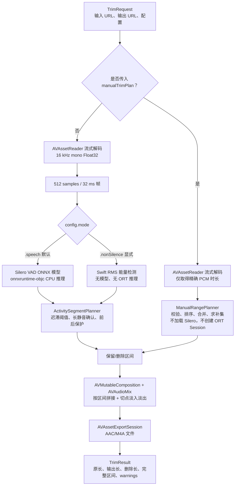

# VadCutIOS 0.2.0

纯 iOS、完全离线、面向长录音的语音/静音裁剪 SDK。默认使用 Silero VAD v6.2.1
识别人声，也可显式选择无模型 RMS 能量检测，或直接传入原始录音时间轴上的保留/删除
区间。输入由 AVFoundation 流式解码，输出重新编码为 AAC/M4A。

> 当前提交已补齐源码、Swift/Objective-C API、单元测试、模拟器端到端测试和 CocoaPods
> 规格。Windows 无法执行 Xcode，因此需要由仓库 macOS CI 完成本次改动的编译/模拟器
> 验证；真实 iPhone 的性能、功耗、后台执行和编解码兼容性仍需真机验收。

## 真实处理链路



音频不会整体加载进内存。自动模式只保留固定 PCM 缓冲、Silero recurrent state 和最终
区间；手动模式连模型和检测器都不会创建，只做流式时长解码和区间导出。

## 什么时候走哪条路径

| 调用方式 | 实际行为 | Silero / ONNX Runtime 推理 |
| --- | --- | --- |
| 默认 `TrimRequest` | `.voiceMemo + .speech`，使用 Silero 判断人声 | 是 / 是 |
| 任一预设 | 三个预设都保持 `.speech`，只改变阈值和时间参数 | 是 / 是 |
| 显式 `config.mode = .nonSilence` | Swift RMS 能量检测，响声、音乐和噪声也可能保留 | 否 / 否 |
| 传入 `manualTrimPlan` | 按调用方区间裁剪，自动检测参数被忽略 | 否 / 否 |

这里的“不执行 ORT”表示本次请求不创建推理会话；由于 CocoaPods 仍链接
`onnxruntime-objc`，ORT 二进制可能继续存在于 App 构建产物中。

## 能力与平台

- iOS 15.1+，Swift 5.10
- iPhone/iPad 真机目标为 64 位 `arm64`；模拟器切片由 CocoaPods 的
  `onnxruntime.xcframework` 和当前 Xcode 目标选择
- Swift async/await、callback、进度和取消
- Objective-C callback API，含手动区间、完整结果字段和稳定 `NSError` 错误码
- Silero `speech`、RMS `nonSilence`、手动保留区间、手动删除区间
- security-scoped 输入/输出 URL
- 临时文件成功完成后再替换目标文件，避免把半成品当作成功结果
- 文件输入；实际可解码格式取决于目标设备上的 AVFoundation
- AAC/M4A 输出；不是无损码流复制

SDK 处理的是已有音频文件，不负责麦克风录音或实时流式 VAD。宿主 App 可先用
`AVAudioRecorder`/`AVAudioEngine` 完成录音，再把文件 URL 交给本 SDK。

## CocoaPods 接入

ONNX Runtime 官方 iOS artifact 通过 CocoaPods 提供：

```ruby
platform :ios, '15.1'

target 'YourApp' do
  use_frameworks! :linkage => :static
  pod 'VadCutIOS',
      :git => 'https://github.com/tianrking/vad_solution.git',
      :branch => 'main'
end
```

开发阶段可固定 commit；发布 `0.2.0` tag 后应改为固定 tag，避免 `main` 更新导致构建
不可复现。私有仓库需要开发机预先拥有 GitHub 访问权限。

## Swift：默认 Silero 自动裁剪

```swift
import VadCutIOS

let request = TrimRequest(
    inputURL: inputURL,
    outputURL: outputURL,
    config: .preset(.voiceMemo)
)

let result = try await VadCut.trim(request) { progress in
    print(progress.phase, progress.percent)
}

print("原始：\(result.inputDurationMilliseconds) ms")
print("输出：\(result.outputDurationMilliseconds) ms")
print("删除：\(result.removedDurationMilliseconds) ms")
print("保留区间：\(result.keptRanges)")
print("删除区间：\(result.removedRanges)")
```

## Swift：显式 RMS 能量模式

```swift
var config = TrimConfig.preset(.voiceMemo)
config.mode = .nonSilence
config.energyThresholdDecibels = -45

let result = try await VadCut.trim(
    TrimRequest(inputURL: inputURL, outputURL: outputURL, config: config)
)
```

RMS 模式只判断“这一帧是否足够响”，不会识别人声语义。音乐、键盘、碰撞声和风噪都
可能被保留；目标是只保留说话时，应继续使用默认 Silero。

## Swift：手动删除或保留区间

区间单位为毫秒，采用半开区间 `[start, end)`，并且始终对应**原始输入时间轴**。

删除指定区间、保留其余内容：

```swift
let result = try await VadCut.trim(
    TrimRequest(
        inputURL: inputURL,
        outputURL: outputURL,
        manualTrimPlan: .removeRanges([
            AudioRange(startMilliseconds: 10_000, endMilliseconds: 15_000),
            AudioRange(startMilliseconds: 42_000, endMilliseconds: 44_500),
        ])
    )
)
```

只保留指定区间、删除其余内容：

```swift
let result = try await VadCut.trim(
    TrimRequest(
        inputURL: inputURL,
        outputURL: outputURL,
        manualTrimPlan: .keepRanges([
            AudioRange(startMilliseconds: 0, endMilliseconds: 8_000),
            AudioRange(startMilliseconds: 12_000, endMilliseconds: 20_000),
        ])
    )
)
```

手动规则：

- 区间不能为空；开始时间必须 `>= 0`，结束时间必须大于开始时间。
- 区间不能超过流式解码得到的输入时长。
- 调用方可以乱序传入，区间可以重叠或首尾相接；SDK 会排序并合并。
- 删除整个输入、或最终没有任何可输出内容时返回 `invalidTimeRanges`。
- 手动模式绕过 Silero 和 RMS；`fadeDurationMilliseconds` 仍用于每个输出片段的边界。
- 返回的 `keptRanges` 和 `removedRanges` 已归一化，可直接用于波形标记和审计。

## Callback 与取消

```swift
let task = VadCut.start(request, onProgress: { progress in
    print(progress.phase, progress.percent)
}) { result in
    print(result)
}

task.cancel()
```

completion 在主线程调用；进度 callback 也会派发到主队列。取消时临时输出会被清理。

## Objective-C

默认 Silero：

```objc
#import <VadCutIOS/VadCutIOS-Swift.h>

VDTrimConfiguration *config = [VDTrimConfiguration new];
config.minimumSilenceDurationMilliseconds = 700;

TrimTask *task = [VadCutObjC trimWithInputURL:inputURL
                                    outputURL:outputURL
                                 configuration:config
                                       progress:
    ^(NSInteger percent, NSString *phase) {
  NSLog(@"%@ %ld", phase, (long)percent);
} completion:^(VDTrimResult *result, NSError *error) {
  if (error != nil) {
    NSLog(@"%@/%ld: %@", error.domain, (long)error.code, error);
  } else {
    NSLog(@"removed=%lld ranges=%@", result.removedDurationMilliseconds,
          result.removedRanges);
  }
}];
```

手动删除：

```objc
VDManualTrimPlan *plan = [VDManualTrimPlan removeRanges:@[
  [[VDAudioRange alloc] initWithStartMilliseconds:10000 endMilliseconds:15000],
  [[VDAudioRange alloc] initWithStartMilliseconds:42000 endMilliseconds:44500],
]];

TrimTask *task = [VadCutObjC trimWithInputURL:inputURL
                                    outputURL:outputURL
                                 configuration:[VDTrimConfiguration new]
                                      manualPlan:plan
                                       progress:nil
                                     completion:
    ^(VDTrimResult *result, NSError *error) {
  // result.keptRanges / removedRanges / warnings 均可从 Objective-C 读取。
}];
```

错误域固定为 `com.vadcut.ios`，`NSError.code` 对应 `VDTrimErrorCode`；字符串错误码同时放在
`error.userInfo[@"VadCutErrorCode"]`。生成的最终声明仍以当前 Xcode 产生的
`VadCutIOS-Swift.h` 为准。

## 默认自动裁剪参数

| 参数 | 默认值 | 含义 |
| --- | ---: | --- |
| 检测帧 | 32 ms / 512 samples | 16 kHz 单声道 Float32 输入 Silero |
| 开始说话概率 | `>= 0.55` | 从非语音进入语音状态 |
| 继续说话概率 | `>= 0.35` | 迟滞阈值，减少边界抖动 |
| 确认长静音 | `700 ms` | 连续低于 0.35 达到此时长才结束当前语音段 |
| 语音前保护 | `180 ms` | 下一段语音前保留的声音 |
| 语音后保护 | `250 ms` | 上一段语音后保留的声音 |
| 最短语音 | `96 ms` | 过滤极短活动段 |
| 切点淡入淡出 | `8 ms` | 降低拼接爆音风险 |
| 未检测到语音 | 保留原音频 | 可改为 `.fail` |

`700 ms` 是确认长静音的门槛，不是固定删除或固定保留 700 ms。短暂停顿通常不会被切；
确认长静音后，最终中间可删除量还要扣除上一段的 250 ms 后保护和下一段的 180 ms
前保护。例如模型判断出 1.5 秒中间静音时，默认约删除 `1500 - 250 - 180 = 1070 ms`，
实际切点还受 32 ms 帧粒度和模型概率影响。

## 预设

| 预设 | 长静音 | 前保护 | 后保护 | 特点 |
| --- | ---: | ---: | ---: | --- |
| `.conservative` | 1200 ms | 250 ms | 350 ms | 保留更多自然停顿 |
| `.voiceMemo` | 700 ms | 180 ms | 250 ms | 默认语音备忘录/访谈参数 |
| `.aggressive` | 350 ms | 100 ms | 140 ms | 更积极删除停顿 |

三个预设都使用 `.speech`，不会自动切换到 RMS。

## 输出与时间信息

`TrimResult` 和 `VDTrimResult` 均返回：

- `outputURL`
- `inputDurationMilliseconds`
- `outputDurationMilliseconds`
- `removedDurationMilliseconds`
- `keptRanges`
- `removedRanges`
- `warnings`

这些时长由实际解码 PCM 样本数得到；容器声明时长只用于进度估算，避免 MP3/AAC 编码
padding 使手动时间轴越过真实 PCM 尾部。输出 M4A 的播放时长可能因 AAC priming 有少量
容器级偏差，测试容许 500 ms 以内差异。

## 模型、运行时与资源

| 项目 | 当前值 |
| --- | --- |
| Silero | v6.2.1 `silero_vad.onnx` |
| 模型大小 | `2,327,524` B，约 2.22 MiB |
| 模型 SHA-256 | 见下方完整哈希 |
| 推理引擎 | `onnxruntime-objc 1.28.0`，CPU，单线程 session |
| 模型份数 | 一份，与 CPU 架构无关；不是为每个架构交叉编译一份模型 |
| 原生架构 | iOS 真机 `arm64`；模拟器 `arm64` + `x86_64` |
| 运行时网络 | 无；运行时不下载模型，也不上传录音 |

```text
1a153a22f4509e292a94e67d6f9b85e8deb25b4988682b7e174c65279d8788e3
```

2026-08-20 对官方 1.28.0 CocoaPods 下载物的直接检查结果：

| artifact | 原始大小 | 内容 |
| --- | ---: | --- |
| `onnxruntime-c` ZIP | 57,395,849 B / 54.74 MiB | C API、头文件和多平台 XCFramework |
| iOS 真机二进制切片 | 44,891,440 B / 42.81 MiB | `ios-arm64` |
| iOS 模拟器二进制切片 | 92,142,648 B / 87.87 MiB | `ios-arm64_x86_64-simulator` |
| `onnxruntime-objc` ZIP | 32,722 B / 31.96 KiB | ObjC 层，依赖 `onnxruntime-c` |

```text
onnxruntime-c.zip SHA-256:
b503cf5949ab718a1dff17d1643237ecc0fecf50ad86264572dcafddb140a327

onnxruntime-objc.zip SHA-256:
973788292d0bc0259c90645be2a4abdbfff2ea60a5f61e7017c06943c9fca5f8
```

当前依赖完整 ONNX Runtime；它明显大于 2.22 MiB 模型。CocoaPods 下载包大小不等于最终
App 增量，最终体积还受 Xcode 选片、静态链接、dead stripping、Bitcode/符号和 App Store
处理影响，应以宿主 App 的 Archive/App Thinning 报告为准。后续可基于 Silero 所需算子
构建 reduced-operator ORT 来缩小体积，但不能只删除文件或 ABI 切片冒充优化。

上表是磁盘 artifact，不是运行时内存。当前仓库尚没有真实 iPhone 的 peak RSS、CPU、
耗时、温升和能耗数据，因此不应从 2.22 MiB 模型或 42.81 MiB 真机切片直接推导 RAM
占用；发布前应在目标机型上用 Instruments 对短录音、长录音和后台场景分别测量。

## 真人普通话回归素材

`Tests/Fixtures/mandarin-silence-demo.mp3` 是 15.200 秒、16 kHz mono、64 kbps MP3：

```text
真人普通话 A [0, 7110) ms
数字静音       [7110, 11110) ms  共 4.000 秒
真人普通话 B [11110, 15200) ms
```

模拟器端到端测试使用默认 Silero，要求输出仍可播放、恰有两段保留区间、删除区间完整覆盖
4 秒插入静音，并用同一 AAC/M4A 编码链路生成完整长度对照，断言裁剪后文件更小。测试会
把裁剪前后时长、字节数和区间打印到 Xcode 日志。素材来源、修改方式、文本、许可证和
哈希见同目录 JSON 及 [第三方声明](THIRD_PARTY_NOTICES.md)。

## 本地开发与验证（macOS）

```bash
cd ios
brew install xcodegen cocoapods
xcodegen generate
pod install --repo-update
xcodebuild test \
  -workspace VadCutIOS.xcworkspace \
  -scheme VadCutIOS \
  -destination 'platform=iOS Simulator,name=iPhone 16 Pro' \
  CODE_SIGNING_ALLOWED=NO

cd ..
pod lib lint VadCutIOS.podspec --allow-warnings --skip-tests --platforms=ios
```

测试范围包括：

- 区间规划、padding/merge、RMS/resampler 基础逻辑
- 手动删除/保留的排序、重叠合并、越界和全删除拒绝
- Swift 自动 Silero、显式 RMS、手动保留、手动删除 M4A 端到端
- 真人普通话 MP3 + 4 秒静音的 Silero 裁剪和同编码体积对照
- Objective-C 工厂方法、结果属性和两个公开 selector 的编译可见性
- 模型 SHA-256 完整性检查

GitHub Actions 配置位于 `.github/workflows/ios-sdk.yml`。CI/模拟器通过只能证明对应
Xcode/模拟器环境的源码、推理和导出链路，不能替代真实 iPhone 验收。

## 已知边界

- 输出会重新编码为 AAC/M4A，不是无损码流复制。
- App 退到后台后，iOS 不保证数小时 CPU 任务持续运行；宿主必须处理取消、恢复和合适的
  BackgroundTasks 策略。
- `AVAssetExportSession` 支持的输入格式和具体编码行为可能随设备/系统版本变化。
- 自动参数不可能覆盖所有口音、距离、噪声和麦克风；上线前必须用目标用户语料验收。
- 当前没有真实 iPhone 的功耗、温度、后台、长录音和多设备矩阵证据。

## 许可证

- SDK：Apache License 2.0，见 [LICENSE](LICENSE)
- 第三方：见 [THIRD_PARTY_NOTICES.md](THIRD_PARTY_NOTICES.md)
- 版本变化：见 [CHANGELOG.md](CHANGELOG.md)
