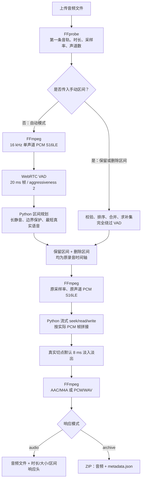

# Linux CPU 音频静音裁剪服务

[English](README_EN.md)

这是项目的 Linux 服务端实现。上传现有音频文件后，它可以自动识别并删除长静音，
也可以按照调用方给出的原始时间轴区间进行精确裁剪，输出 M4A、WAV，或者包含音频与
完整 JSON 清单的 ZIP。

当前版本为 `0.2.0`，核心是 `webrtcvad-wheels==2.0.14` 提供的 CPU WebRTC VAD。
它不使用 Silero、ONNX 模型或 ONNX Runtime，也不需要 GPU。

## 真实处理链



这里的“PCM 重建”是确定性的字节区间拼接，不是生成模型、语音修复或重采样到固定输出。
自动分析流固定为 16 kHz 单声道；最终重建仍使用输入音轨的采样率和声道数。

## 自动裁剪规则

默认参数：

| 参数 | 默认值 | 真实含义 |
| --- | ---: | --- |
| `frame_ms` | `20` | WebRTC VAD 只接受 10、20、30 ms |
| `aggressiveness` | `2` | WebRTC VAD 激进程度，0 最宽松、3 最激进 |
| `min_silence_ms` | `800` | 连续非语音达到 800 ms 才确认一个长静音切点 |
| `keep_silence_ms` | `250` | 长静音两端合计保留 250 ms，默认每侧 125 ms |
| `padding_ms` | `80` | 额外词头/词尾保护；每侧最终取 `max(80, 250 / 2) = 125 ms` |
| `min_speech_ms` | `160` | 只统计 VAD 判为语音的帧，不把 padding 或短停顿算进去 |
| `fade_ms` | `8` | 仅在真正编辑切点做淡入/淡出，降低爆音和咔哒声 |
| `no_speech_policy` | `keep_original` | 没检测到语音时安全保留原内容；可设为 `error` 返回 422 |

所以，短于 800 ms 的停顿通常留在同一个语音区间中。静音达到阈值后才回退到最后一个
语音帧并应用两侧保护。默认情况下，恰好 800 ms 的长静音大约删除：

```text
800 - 125 - 125 = 550 ms
```

时间仍受 20 ms 帧粒度和 WebRTC 判定结果影响。`aggressiveness` 不是概率阈值；
WebRTC VAD 直接返回每帧“语音/非语音”布尔值。

本版修正了旧逻辑中一个重要问题：`min_speech_ms` 现在只累计真正的语音帧。过去边界
padding 可能让很短的噪声片段错误地通过最短语音检查。

## 手动时间点

可以传入“保留区间”或“删除区间”，两者互斥。区间单位为毫秒，基于原录音时间轴；
无序、重叠或相邻区间会排序并合并，越界、反向或非数字区间返回 422。

支持两种 JSON 写法：

```json
[[0, 2500], [7000, 9200]]
```

```json
[
  {"start_ms": 0, "end_ms": 2500},
  {"start_ms": 7000, "end_ms": 9200}
]
```

传入 `manual_keep_ranges_ms` 时只保留这些区间；传入 `manual_remove_ranges_ms` 时删除
这些区间并自动计算补集。手动模式不会生成 16 kHz 分析 PCM，也不会初始化 WebRTC VAD。

## 快速开始

需要 Python 3.11+、FFmpeg 和 FFprobe。

Linux/macOS：

```bash
cd linux
python3.11 -m venv .venv
. .venv/bin/activate
python -m pip install -r requirements.txt
python -m uvicorn app.main:app --host 127.0.0.1 --port 8000
```

Windows 开发机：

```powershell
cd linux
py -3.11 -m venv .venv
.\.venv\Scripts\python.exe -m pip install -r requirements.txt
.\.venv\Scripts\python.exe -m uvicorn app.main:app --host 127.0.0.1 --port 8000
```

健康检查：

```bash
curl http://127.0.0.1:8000/healthz
```

返回值会明确显示 `vad: webrtc`、`model: null`，避免把它误解为 Silero/ONNX。

## API 示例

自动删除长静音：

```bash
curl -X POST http://127.0.0.1:8000/v1/audio/remove-long-silence \
  -H "X-API-Key: <private-api-key>" \
  -F "file=@input.mp3" \
  -F "output_format=m4a" \
  -F "min_silence_ms=800" \
  -F "keep_silence_ms=250" \
  -F "padding_ms=80" \
  -F "fade_ms=8" \
  --output output.m4a
```

精确删除原时间轴上的 2.5–7.0 秒：

```bash
curl -X POST http://127.0.0.1:8000/v1/audio/remove-long-silence \
  -H "X-API-Key: <private-api-key>" \
  -F "file=@input.mp3" \
  -F "output_format=m4a" \
  -F "manual_remove_ranges_ms=[[2500,7000]]" \
  --output output.m4a
```

需要完整、无响应头长度限制的审计数据时：

```bash
curl -X POST http://127.0.0.1:8000/v1/audio/remove-long-silence \
  -H "X-API-Key: <private-api-key>" \
  -F "file=@input.mp3" \
  -F "output_format=m4a" \
  -F "response_mode=archive" \
  --output result.zip
```

`result.zip` 包含处理后的音频和 `metadata.json`。清单包含：

- 输入、输出、删除时长（毫秒）
- 输入、输出文件大小（字节）
- 原采样率、原声道数
- 实际检测器（`webrtc_vad` 或 `manual`）
- 完整 `kept_ranges_ms` 和 `removed_ranges_ms`
- 生效参数与告警

默认 `response_mode=audio` 直接返回音频。摘要响应头包括：

```text
X-Original-Duration-Milliseconds
X-Output-Duration-Milliseconds
X-Removed-Duration-Milliseconds
X-Input-Bytes
X-Output-Bytes
X-Detector
X-Kept-Range-Count
X-Removed-Range-Count
X-Kept-Ranges-Milliseconds
X-Removed-Ranges-Milliseconds
```

当完整区间超过默认 4096 字节响应头预算时，`X-Range-Metadata` 会提示使用
`response_mode=archive`，避免被反向代理截断。

## Docker 部署

```bash
cd linux
cp .env.example .env
docker compose up -d --build
curl http://127.0.0.1:8080/healthz
```

Compose 默认只绑定 `127.0.0.1:8080`。生产环境应放在 Nginx、Caddy 或现有 HTTPS
网关后面，并在 `.env` 设置足够长的随机 `API_KEY`。处理接口接受 `X-API-Key` 或
`Authorization: Bearer <API_KEY>`；`/healthz` 保持公开。

默认资源边界：

```text
CPU：2 cores
内存：2 GB
最大上传：200 MB
最大音频时长：3600 秒
最大并行任务：2
手动区间上限：512
FFmpeg 每个任务：1 thread
```

并发限制覆盖上传落盘与处理阶段，避免大量请求同时占满工作卷。分析 PCM 在 VAD 完成后
立即删除，原采样率 PCM 在区间重建后立即删除，渲染 PCM 在编码后立即删除；响应完成后
整个任务目录会清理。长录音仍可能同时存在源 PCM 和输出 PCM，生产主机应为工作卷预留
足够磁盘。

## 本地验证

安装开发依赖并运行：

```bash
python -m pip install -r requirements-dev.txt
python -m pip check
python -m compileall -q app tests
python -m ruff check app tests
python -m ruff format --check app tests
python -m pytest -q
```

当前测试包含区间规划、最短真实语音、尾部半帧、手动区间求补、PCM 实际帧计时、
切点淡化、HTTP 音频响应、ZIP 清单以及真实普通话 MP3 端到端处理。

在 Windows + Python 3.11 + FFmpeg 8.1 的本地回归中，共享普通话样本结果为：

| 项目 | 结果 |
| --- | ---: |
| 输入时长 | 15,200 ms |
| 输出时长 | 11,070 ms |
| 删除时长 | 4,130 ms |
| 保留区间 | `[0, 6905)`、`[11035, 15200)` ms |
| 删除区间 | `[6905, 11035)` ms |
| 输入 MP3 | 122,949 bytes |
| 输出 M4A | 100,671 bytes |

输入 MP3 与输出 M4A 的编码不同，文件大小不能直接当作裁剪比例。相同编码链的完整 M4A
为 101,434 bytes；数字静音本身非常容易压缩，因此时长减少 27.2%，文件大小只减少约
0.75%，这是正常的编码现象。

GitHub Actions 会在 Ubuntu/Python 3.11 上运行全部测试、真实音频链并构建 Linux 容器。

## 生产边界

- 这是已有音频文件的同步 HTTP 处理服务，不是实时麦克风流式 VAD。
- WebRTC VAD 无语言参数，可处理中文、英文等语音，但准确率仍取决于噪声、距离和设备。
- 音乐、强键盘声或风噪可能被判为语音；上线前应用目标录音集测误删率和漏删率。
- M4A 会重新编码为 AAC；WAV 是 PCM S16LE，均不是压缩码流无损拼接。
- 当前没有任务队列、对象存储、断点续传或多节点调度；长任务和规模化部署需在服务外层补齐。
- 不记录音频内容；FFmpeg 使用参数数组调用，不把用户字符串拼接进 shell。
