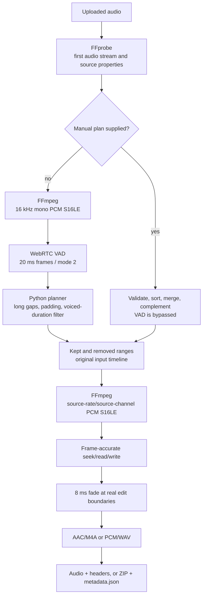

# Linux CPU Audio Silence Service

[中文](README.md)

This is the repository's Linux server implementation. It removes long silence
from uploaded audio with CPU WebRTC VAD, or applies caller-supplied keep/remove
ranges on the original timeline. It returns M4A, WAV, or a ZIP containing the
audio and a complete JSON manifest.

Version `0.2.0` uses `webrtcvad-wheels==2.0.14`. It does not use Silero, an
ONNX model, ONNX Runtime, or a GPU.

## Actual pipeline



“PCM reconstruction” means deterministic PCM range copying. It is not a
generative model or audio repair. The VAD analysis copy is 16 kHz mono, while
the final reconstruction keeps the input stream's sample rate and channel
count.

## Automatic defaults

| Field | Default | Meaning |
| --- | ---: | --- |
| `frame_ms` | `20` | WebRTC accepts 10, 20, or 30 ms frames |
| `aggressiveness` | `2` | WebRTC mode from 0 (least aggressive) to 3 |
| `min_silence_ms` | `800` | Confirm a cut only after continuous non-speech |
| `keep_silence_ms` | `250` | Total boundary silence, split to 125 ms per side |
| `padding_ms` | `80` | Each side uses `max(padding, keep_silence / 2)` |
| `min_speech_ms` | `160` | Counts voiced frames only, excluding padding and gaps |
| `fade_ms` | `8` | Fade actual edit edges to reduce clicks |
| `no_speech_policy` | `keep_original` | Safe fallback; `error` returns HTTP 422 |

Pauses shorter than 800 ms normally remain inside one range. At the exact
threshold, the default removable middle is approximately
`800 - 125 - 125 = 550 ms`, subject to 20 ms frame granularity and WebRTC
decisions. WebRTC returns a Boolean decision; `aggressiveness` is not a neural
probability threshold.

Version 0.2 fixes the former minimum-speech check: boundary padding can no
longer make a tiny noise burst pass `min_speech_ms`.

## Manual timeline editing

Supply exactly one of `manual_keep_ranges_ms` or `manual_remove_ranges_ms`.
Ranges use the original timeline and may be pairs or objects:

```json
[[0, 2500], [7000, 9200]]
```

```json
[
  {"start_ms": 0, "end_ms": 2500},
  {"start_ms": 7000, "end_ms": 9200}
]
```

Ranges are validated, sorted, and merged. Manual mode bypasses both the 16 kHz
analysis decode and WebRTC VAD.

## Run locally

```bash
cd linux
python3.11 -m venv .venv
. .venv/bin/activate
python -m pip install -r requirements.txt
python -m uvicorn app.main:app --host 127.0.0.1 --port 8000
```

```bash
curl http://127.0.0.1:8000/healthz
```

The health response explicitly reports `vad: webrtc` and `model: null`.

## API examples

Automatic processing:

```bash
curl -X POST http://127.0.0.1:8000/v1/audio/remove-long-silence \
  -H "X-API-Key: <private-api-key>" \
  -F "file=@input.mp3" \
  -F "output_format=m4a" \
  --output output.m4a
```

Remove 2.5–7.0 seconds from the original timeline:

```bash
curl -X POST http://127.0.0.1:8000/v1/audio/remove-long-silence \
  -H "X-API-Key: <private-api-key>" \
  -F "file=@input.mp3" \
  -F "manual_remove_ranges_ms=[[2500,7000]]" \
  --output output.m4a
```

Request complete metadata without HTTP header-size constraints:

```bash
curl -X POST http://127.0.0.1:8000/v1/audio/remove-long-silence \
  -H "X-API-Key: <private-api-key>" \
  -F "file=@input.mp3" \
  -F "response_mode=archive" \
  --output result.zip
```

The ZIP contains the processed audio and `metadata.json` with input/output/
removed durations, byte sizes, source format, detector, all kept/removed
ranges, effective parameters, and warnings.

The default `response_mode=audio` exposes summary and compact range headers.
If the range JSON exceeds the configured 4096-byte budget,
`X-Range-Metadata` directs the caller to archive mode.

## Docker

```bash
cd linux
cp .env.example .env
docker compose up -d --build
curl http://127.0.0.1:8080/healthz
```

Compose binds to `127.0.0.1:8080`. Put it behind an authenticated HTTPS
reverse proxy and set a strong `API_KEY` before exposing it. The default limits
are 200 MB per upload, 3,600 seconds, two concurrent jobs, 512 manual ranges,
two CPU cores, 2 GB RAM, and one FFmpeg thread per job.

Concurrency covers upload persistence and processing. Analysis, source, and
rendered PCM files are removed as soon as their stage completes; the full job
directory is removed after the response. Long source and rendered PCM can
still coexist during reconstruction, so provision the work volume for the
largest accepted input.

## Verification

```bash
python -m pip install -r requirements-dev.txt
python -m pip check
python -m compileall -q app tests
python -m ruff check app tests
python -m ruff format --check app tests
python -m pytest -q
```

Tests cover segmentation, voiced-duration filtering, partial frames, manual
range complements, frame-accurate rendering, fades, HTTP responses, ZIP
metadata, and a real Mandarin MP3 end to end.

The current Windows/Python 3.11/FFmpeg 8.1 baseline for the shared Mandarin
fixture is 15,200 ms input, 11,070 ms output, and 4,130 ms removed. Kept ranges
are `[0, 6905)` and `[11035, 15200)` ms. The input MP3 is 122,949 bytes and the
output M4A is 100,671 bytes; those codec sizes are not directly comparable.
A full-duration M4A from the same encoding path is 101,434 bytes. Digital
silence compresses efficiently, so duration fell 27.2% while same-codec size
fell only about 0.75%.

GitHub Actions runs the full suite and real-audio chain on Ubuntu/Python 3.11,
then builds the Linux container.

## Boundaries

- This is a synchronous existing-file service, not live microphone streaming.
- WebRTC VAD has no language setting; validate production accuracy on target
  languages, microphones, distances, and noise.
- Music and strong non-speech noise may be retained.
- M4A is re-encoded to AAC; WAV contains PCM S16LE.
- A queue, object storage, resumable upload, and multi-node scheduling remain
  external production concerns.
- Audio content is not logged, and FFmpeg is invoked with argument arrays.
